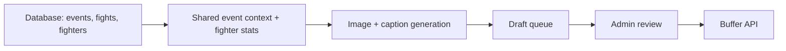

# Database Driven Content Creation With UltimateFightIQ

**Project:** Ultimate Fight IQ (UFIQ)
**Link:** [https://ultimatefightiq.com](https://ultimatefightiq.com)

**Case study type:** Product build
**The task:** Generate and schedule fight-week social posts from live event data without inventing fighter names, stats, or URLs.
**What we learned:** Treat the database as the only source of facts, inject that context into generation prompts, and keep humans in the loop before anything hits Buffer.
**Last updated:** December 31, 2026

## Case study at a glance

|                     |                                                                                                                                                                                   |
| ------------------- | --------------------------------------------------------------------------------------------------------------------------------------------------------------------------------- |
| **The task**        | Auto-build image + caption drafts for every bout on a published UFC card, grounded in live product data, then schedule them through Buffer.                                       |
| **Who it was for**  | UFIQ admins running fight-week marketing without retyping card details or risking hallucinated stats.                                                                             |
| **Main constraint** | AI image and caption models will invent names, records, and links unless facts are structured and labeled as ground truth.                                                        |
| **What we built**   | A database-backed context layer, bulk generation worker, admin review queue, and publish-triggered auto campaigns wired to Buffer.                                                |
| **Outcome**         | Publishing an event kicks off a full-card social pipeline: one announcement post plus one post per matchup, each built from the same event and fighter data users see in the app. |

## Background

Ultimate Fight IQ already stores everything a fan needs to make picks: events, fight cards, fighter profiles, lock times, and verified results. Fight-week social content needs the same facts, but formatted for Instagram and X.

The easy path is to prompt a generic model: "Write a post about the next UFC card." That path fails quickly. Names get misspelled. Records drift. Links point nowhere. Visual stat overlays show numbers that do not match the product.

The product already had accurate data in the database. The job was not "add AI to social." It was to **route product data into generation and posting**, with guardrails that keep creativity separate from facts.

## The task

When an admin publishes a UFC event in UFIQ, the system should:

1. Pull the full card, fighter likenesses, and event metadata from the database.
2. Generate one promotional image and caption per matchup (plus an event-level thumbnail).
3. Spread posts across the window before picks lock.
4. Let an admin review, edit, and approve before posts go to Buffer.

One sentence version: **use the same database that powers picks to power social content, automatically, with accurate context.**

## Constraints

- **Hallucination risk:** Image models and caption models will fill gaps if context is vague.
- **Schema drift:** Event, fight, and fighter data appears in multiple places across the app and backend. Duplicated queries would diverge over time.
- **Rate limits:** Bulk image generation cannot fire all at once.
- **Brand safety:** Auto-posting without review is unacceptable for a young product.
- **Scheduling reality:** Posts should anchor to pick lock time, not arbitrary calendar guesses.
- **Platform plumbing:** Buffer handles OAuth, channel metadata, and final scheduling. UFIQ should not reimplement that.

## Our approach

We split the problem into four layers:

Facts live in the database. A shared context builder formats them. Models only handle visuals and copy tone. A queue stores drafts. Humans approve. Buffer publishes.

## How we solved it

### Step 1: One shared event context fetcher

**What we did:** Built a single shared module that loads event and card data for both image and caption generators.

**Decision:** One place owns how events, fights, and fighters are joined, how card sections are ordered, how results are formatted, and what helper lines captions receive.

**Why:** Without this, the admin UI, image worker, and thumbnail generator would each pull slightly different fields. Social posts would drift from what users see on event pages.

The fetcher returns structured blocks labeled as ground truth, for example:

- Event name, date, venue
- Main event and co-main with records
- Card lines tagged by section (main card, prelims, early prelims)
- Verified results when recap mode is on
- A canonical event URL derived from the event slug

Caption context explicitly includes the real event link and instructs the model to use it verbatim.

### Step 2: Fighter stats as a typed catalog, not free text

**What we did:** Defined a catalog mapping stat choices to real fighter table columns: height, reach, record, striking accuracy, takedown defense, and more.

**Decision:** Admins pick stats by name. The worker loads only those columns from the database and formats labeled lines for the model.

**Why:** Letting the model "summarize a fighter" invites invented numbers. Mapping admin choices to database columns keeps overlays and captions tied to the same data the app displays.

### Step 3: Separate facts from creative instructions in prompts

**What we did:** Structured every image prompt to concatenate:

1. Preset system prompt and brief (creative direction)
2. Event and fighter context blocks (database facts)
3. Fighter likeness reference images from stored profile photos
4. Style reference images from admin presets

Captions use a second call with a fixed system prompt plus context lines from the same event object.

**Decision:** Prefix factual blocks with explicit language: "ground truth," "do not invent names," "do not invent stats."

**Why:** Models behave better when creative and factual sections are visually separated. The instruction is not "be accurate." It is "here is the truth; do not override it."

### Step 4: Bulk jobs that mirror the card structure

**What we did:** Introduced bulk jobs and per-post queue items. A job represents one generation run (manual or automatic). Each item maps to one social post: a bout matchup or a fighter spotlight.

**Decision:** Store bout order, card section, fighter names, selected stats, scheduled time, generated image, caption, and Buffer post IDs on each row.

**Why:** The card is the natural unit of fight-week content. Persisting one row per post makes review, reschedule, regenerate, and audit straightforward.

A background worker processes items sequentially with a minimum interval between image API calls, then continues until the job completes.

### Step 5: Lock-relative scheduling

**What we did:** For auto campaigns, scheduling spreads posts evenly between a lead time after creation and a safety buffer before pick lock (default two hours before lock, up to seven days back).

For manual bulk runs, admins can attach offset presets (for example, three days before lock, one hour before lock) so each matchup fans out to multiple timed posts.

**Decision:** Anchor timing to pick lock, the same moment picks close in the product.

**Why:** Social hype and product behavior should share one clock. Fight-week posts that land after lock are useless for driving picks.

### Step 6: Auto-trigger on event publish, with an off switch

**What we did:** When an admin publishes an event, the system can automatically start a social campaign unless auto campaigns are turned off in settings.

The auto campaign:

1. Confirms required image presets exist
2. Reads connected Buffer channels (all or admin-selected)
3. Cancels any prior running campaign for the same event
4. Creates a job tagged as an event-publish campaign
5. Queues one thumbnail item plus one item per fight on the card
6. Starts the generation worker

**Decision:** Automation starts at publish, not on a fixed cron. Admins can pause auto campaigns globally without losing manual bulk tools.

**Why:** Publishing is the operational signal that the card is real and ready to promote. Tying social generation to that moment removes a manual "remember to start the campaign" step.

### Step 7: Human review before Buffer

**What we did:** Items move through statuses: pending, generating, ready, approved, scheduled.

Admins review images and captions in a bulk queue UI, edit copy, regenerate failures, then approve batches. Approved items are sent to Buffer with signed URLs for generated images.

**Decision:** Generation is automatic. Publishing to social is intentional.

**Why:** One wrong fighter name on a main event post costs more than the time saved by full autopost. Review is the quality gate.

### Step 8: Buffer as the posting layer

**What we did:** Kept OAuth tokens encrypted server-side. A dedicated posting integration builds Buffer payloads, handles image and video assets, and sets Instagram metadata (Reel vs post) when needed.

**Decision:** UFIQ generates content and context. Buffer owns channel credentials and the final schedule on each network.

**Why:** Posting APIs, token refresh, and per-platform quirks are not core product logic. The database-backed generator should not depend on Buffer's schema beyond a thin adapter.

## What we built

| Piece | Role |
| --- | --- |
| Shared event context loader | Formats events, fights, fighters, results, and caption lines from the database |
| Fighter stat catalog | Selective stat loading for spotlight posts |
| Image and caption generation service | Image generation, caption generation, bulk worker, auto campaigns |
| Bulk job and item queue | Persistent queue of drafts with schedule and status |
| Schedule offset presets | Lock-relative timing presets for manual bulk runs |
| Campaign audit log | Lifecycle tracking for auto campaigns |
| Admin bulk queue and auto campaign panels | Review, edit, approve, and monitor |
| Buffer posting integration | Secure posting to connected X and Instagram channels |

End-to-end flow for a published event:

1. Admin publishes event in UFIQ.
2. System reads the card from the database.
3. Worker generates images using factual context and style presets.
4. Captions are written from the same context, including the real event URL.
5. Admin approves items in the queue.
6. Buffer schedules posts to selected channels at precomputed times.

## Results

### Before

- Social content was manual: copy card details by hand, hunt for fighter photos, guess post timing.
- Generic AI drafts required heavy fact-checking.
- No link between pick lock time and post schedule.

### After

- Publishing an event starts a full-card draft pipeline automatically (when enabled).
- Every generated post is tied to a specific bout or event in the database.
- Captions receive the canonical event URL from the slug, not an invented path.
- Admins review a grid of ready items before anything reaches Buffer.
- Campaign timeline shows generation progress and failures per item.

### How we know it worked

Success is operational, not vanity metrics:

- Queue items store bout order and fighter names copied from the database at job creation time.
- Image prompts include the same event context used elsewhere in the product.
- Caption instructions forbid placeholder URLs and require the exact link when provided in context.
- Auto campaigns log ready, failed, and completed states for troubleshooting.
- Re-publishing cancels superseded jobs so stale card data does not keep generating.

## What you can learn

1. **Do not ask the model what the database already knows.** Fetch facts first. Use AI for layout, tone, and visuals only.
2. **Label truth in prompts.** Explicit "ground truth" sections outperform vague "be accurate" instructions.
3. **One context module per domain.** Event cards change shape over time. Centralize the join once.
4. **Keep admin choices aligned with what the worker can load.** Stat selections must map to real database fields or generation will fail silently.
5. **Automate drafts, not judgment.** A ready-to-approved gate protects brand trust while still saving hours of production time.
6. **Schedule against product events.** Lock time is a stronger anchor than "post every 8 hours."
7. **Separate generation from distribution.** Your database pipeline should not break when a social API changes. Keep Buffer (or any scheduler) behind an adapter.

## Next step

If you run a data-rich product (sports, finance, education, local events), the pattern transfers: **query, structure, generate, review, publish**.

For UFIQ, natural extensions include recap campaigns after results are verified, fighter spotlight series using stat presets, and feedback loops on which posts drove event page visits before lock.
