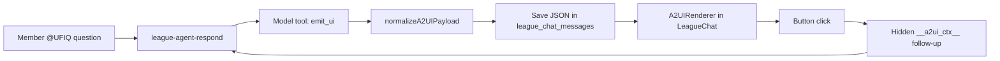

# Why Our Chat Agent Returns UI Components, Not Markdown Walls

**Project:** Ultimate Fight IQ (UFIQ)
**Link:** [https://ultimatefightiq.com](https://ultimatefightiq.com)

**Case study type:** Feature design
**The task:** Let `@UFIQ` answer league questions with scannable, interactive UI inside chat instead of long markdown tables members will not read.
**What we learned:** Give the agent an `emit_ui` tool with a strict component catalog, normalize payloads server-side, and wire button clicks back into the same agent loop with hidden context.
**Last updated:** June 23, 2026

## Case study at a glance

| | |
|---|---|
| **The task** | Render structured league data (standings, live board, fight rows, buttons) inline in league chat |
| **Who it was for** | League members asking `@UFIQ` / `@iq` for picks, standings, and live state during fight week |
| **Main constraint** | Model output drifts (wrong prop names, nested objects, PII leaks); chat must stay on-brand and rate-limited |
| **What we built** | A2UI: JSON component tree in agent messages, `A2UIRenderer` on the client, `normalizeA2UI` on the edge, and click-to-drill-down via hidden context |
| **Outcome** | Standings, live leaderboards, and fight rows render as native UI; buttons re-invoke the agent with structured follow-up context |

## Background

Ultimate Fight IQ ships an in-league AI agent (`league-agent-respond`) documented in the League Agent case study. Early replies were markdown: bullet standings, pasted fight lists, walls of text.

That failed the product job:

1. **Members scan, they do not read.** Fight week questions want rank, avatar, and live dots, not paragraphs.
2. **Tables break on mobile.** Chat width is narrow; markdown tables wrap badly.
3. **No drill-down.** A static answer cannot become "show me their picks" without a second typed question.
4. **Brand consistency.** Fighter names, red accents, and square corners are product rules, not LLM habits.

We already had production components (`LiveLeaderboardForEvent`, `SeasonalStandingsForLeague`). The task was to **let the agent emit those components safely**, not reimplement them in prose.

## The task

Build A2UI so that:

1. The model can call `emit_ui` with a JSON `{ a2ui: { component, props, children } }` tree.
2. The frontend parses agent message bodies and renders via `A2UIRenderer`.
3. Server-side normalization fixes common prop drift before save.
4. `Button` actions post `@UFIQ <action>` with hidden `__a2ui_ctx__` JSON for follow-up turns.
5. Live and seasonal surfaces embed real components, not simplified stubs.

One sentence version: **treat agent replies as UI payloads the app renders, not documents the model formats.**

## Constraints

- **Payload size.** JSON agent bodies cap at 8,000 chars vs 1,900 for plain text.
- **Tool loop cap.** `MAX_TOOL_ROUNDS = 6` in `runLoop.ts`.
- **PII normalization.** Username wins over display name in `normalizeA2UI.ts`.
- **Brand rules in renderer.** No borders, square corners, red reserved for primary buttons and fighter first names.
- **Rate limits.** A2UI button clicks use the same `@UFIQ` mention path and existing run limits.

## Our approach

1. **Emit path.** Model calls `emit_ui`; loop intercepts and stores normalized JSON as message body.
2. **Parse path.** `parseA2UI.ts` strips fences and accepts bare `{ component }` roots.
3. **Render path.** `A2UIRenderer.tsx` maps component names to React widgets.
4. **Action path.** `LeagueChat.onAgentAction` inserts a new mention with zero-width sentinel + context JSON; edge strips sentinel and passes `lastAction` to the prompt.

## How we solved it

### Step 1: Define a component catalog in docs and skills

**What we did:** Documented components in `docs/guides/a2ui-agent.md` and agent skill resources (`picks-and-standings.md`): `StandingsList`, `LiveLeaderboard`, `FightRow`, `MemberRow`, layout primitives, `Button`, etc.

**Decision:** Closed catalog the model must use, not arbitrary HTML.

**Why:** Open-ended markup is an XSS and brand risk; named components are testable.

### Step 2: Add `emit_ui` and intercept in the tool loop

**What we did:** Registered `emit_ui` in `tools/registry.ts`. `runLoop.ts` intercepts the tool result, runs normalization, and writes JSON string body instead of markdown summary.

**Decision:** UI emission is a first-class tool outcome, not a markdown code block hack.

**Why:** Code blocks are unparsed strings; tool intercept guarantees schema handling.

### Step 3: Normalize payloads server-side

**What we did:** `normalizeA2UIPayload()` renames aliases (`eventName` → `name`, `fighterA` → `fighter_a`), flattens nested fighter objects, and enforces PII rules before persistence.

**Decision:** Fix model drift in code, not with longer prompts alone.

**Why:** Models rename props; normalization keeps the renderer stable.

### Step 4: Embed production components for heavy surfaces

**What we did:** `LiveLeaderboard` and `SeasonalStandings` cases mount `LiveLeaderboardForEvent` and `SeasonalStandingsForLeague` with slug/id resolution from `events` table.

**Decision:** Full fidelity embeds, not chat-lite copies.

**Why:** Members asking for the live board should see the same board as `/leaderboard`.

### Step 5: Wire click-to-drill-down actions

**What we did:** `Button` with `action` and optional `context` triggers `onAgentAction`, which inserts `@UFIQ <action>\u200B__a2ui_ctx__::<JSON>` into `league_chat_messages`. Edge function strips the sentinel, shows clean visible text, and passes structured `lastAction` into the model prompt.

**Decision:** Reuse the mention pipeline instead of a separate action API.

**Why:** One auth, one rate limit, one trace path for agent runs.

### Step 6: Enforce brand in the renderer

**What we did:** Hard-coded styling rules in `A2UIRenderer`: square corners, no card borders, fighter first-name red, primary red buttons only.

**Decision:** Renderer owns brand; the model supplies structure only.

**Why:** LLM-themed CSS drifts every week; React components do not.

## What we built

| Piece | Role |
|-------|------|
| `emit_ui` tool | Agent emits JSON component trees |
| `normalizeA2UI.ts` | Server-side alias and PII cleanup |
| `parseA2UI.ts` | Client parser for message bodies |
| `A2UIRenderer.tsx` | Component registry + brand rules |
| `LeagueChat.tsx` | Renders A2UI messages, handles button actions |
| `StandingsList` / `FightRow` / `LiveLeaderboard` | Domain widgets |
| `docs/guides/a2ui-agent.md` | Operator and developer catalog |

Additional widgets: `EventHeader`, `FighterChip`, `MemberChip`, `KeyValueList`, `Table`, layout primitives (`Container`, `Row`, `Grid`, `Tabs`, `Accordion`), and auto-wrapped `GeneratedImage` for image tool output.

## Results

### Before

- Standings and fight answers arrived as markdown walls.
- Mobile chat made tables unreadable.
- Follow-up questions required retyping context the agent already had.
- Live board answers could not match the main app UI.

### After

- Agent messages can be full UI trees parsed and rendered inline.
- Standings show avatars, ranks, and points in `MemberRow` layout.
- Live leaderboard embed uses production components with Realtime subscriptions.
- Buttons re-open the agent loop with structured context, not free-text guesswork.
- Server normalization catches prop alias drift before render.

### How we know it worked

- `docs/guides/a2ui-agent.md` documents payload shape, limits, and action sentinel format.
- Agent skill forbids wrapping `LiveLeaderboard` in extra containers.
- `MatchupStatesDemo.tsx` exercises A2UI states for QA.
- Tool trace UI shows `emit_ui` calls alongside other agent tools.

## What you can learn

1. **Chat agents need a UI channel.** Markdown is fine for sentences; structured data wants components.
2. **Normalize on the server.** Models drift; renderers should not.
3. **Reuse production widgets.** Parity beats "chat simplified" duplicates.
4. **Actions are messages.** Hidden context on the same `@mention` path keeps ops simple.
5. **Close the catalog.** Named components beat arbitrary HTML for security and brand.
6. **Cap payload and tool rounds.** UI JSON can balloon; enforce limits early.

## Next step

Open a league chat, ask `@UFIQ` for standings or the live board, and confirm A2UI renders. Click a primary button and verify the follow-up run receives `lastAction` context. Extend the catalog in `A2UIRenderer.tsx` and `docs/guides/a2ui-agent.md` together.

For developers: add components in the renderer first, then document props in the agent skill so `emit_ui` stays aligned.
