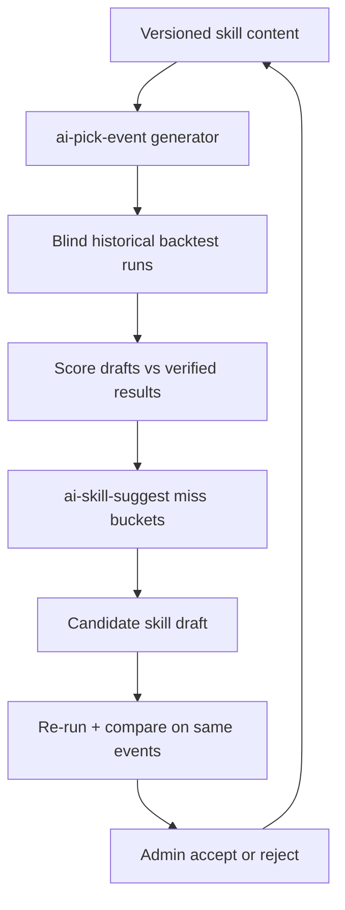

# How We Optimize UFIQ's Agent Skill for making AI Picks

**Project:** Ultimate Fight IQ (UFIQ)
**Link:** [https://ultimatefightiq.com](https://ultimatefightiq.com)

**Case study type:** Product build
**The task:** Improve AI-generated UFC fantasy picks over time without invisible prompt drift, model-skill confounding, or changes that leak into live member picks.
**What we learned:** Treat picking logic as a versioned skill, score it in blind historical backtests, and let humans accept bounded edits only after side-by-side validation.
**Last updated:** June 23, 2026

## Case study at a glance

|                     |                                                                                                                                                                          |
| ------------------- | ------------------------------------------------------------------------------------------------------------------------------------------------------------------------ |
| **The task**        | Build an admin workflow to run, score, suggest, test, and accept improvements to the AI Picks evaluation skill                                                           |
| **Who it was for**  | UFIQ admins tuning fantasy pick quality before any draft influences public surfaces                                                                                      |
| **Main constraint** | Fantasy-only sandbox: no writes to member picks, leaderboards, or standings; no unbounded prompt rewrites                                                                |
| **What we built**   | Versioned `ai-picks-fight-evaluation` skill, blind backtest mode, `ai-skill-suggest` miss analysis, Skill Optimization Lab UI, and a human-in-the-loop optimization loop |
| **Outcome**         | Admins can compare model × skill_version on the same events, draft candidate skills from real miss patterns, and accept or reject edits with a full audit trail          |

## Background

Ultimate Fight IQ generates structured fantasy picks for UFC cards: winner, method, round, confidence, and a short rationale. Early versions baked that reasoning into a monolithic edge-function prompt. That worked for a first ship, but it created three problems:

1. **No audit trail.** Prompt tweaks were invisible diffs buried in deploys.
2. **No clean experiments.** When accuracy moved, we could not tell whether the model or the instructions changed.
3. **No safe learning loop.** It was tempting to "fix" the prompt after one bad card, which is how you overfit to upsets and fighter names.

The product already had an admin AI Picks cockpit with historical backtest mode. The missing piece was a **governed optimization system**: version the picking framework, score it blind, propose bounded edits from evidence, and require human approval before a new version ships.

## The task

Give admins a repeatable way to:

1. Run the current picking skill against verified historical events without leaking results into the prompt.
2. Score winner accuracy, method accuracy, perfect picks, and calibration per model and per skill version.
3. Generate a candidate skill edit from observed miss patterns (overconfident losses, method misses, under-confident hits).
4. Re-run the candidate on the same events with the same model and compare side by side.
5. Accept or reject the candidate without mutating the base version, and never touch live member data.

One sentence version: **turn AI pick quality into a versioned, testable, human-approved skill instead of a moving prompt.**

## Constraints

- **Fantasy sandbox only.** Optimization runs write to `ai_pick_runs` and `ai_pick_drafts`, not `picks` or `pick_scores`.
- **Blind evaluation.** Historical backtests use a fixed blind context (`v1-fighter-static`) that omits winner, method, and result fields from the digest.
- **Bounded edits.** A candidate may refine one section or append a `Candidate Lessons` block. It cannot rewrite the entire skill in one pass.
- **No silent fallback.** If a requested `skill_version` is missing, `ai-pick-event` returns an error instead of quietly running the builtin skill. That prevents mis-attributed run history.
- **Human gate.** Acceptance is additive: new rows in `ai_pick_skill_versions`, never in-place edits to the active version.
- **Anti-overfitting rules.** No fighter-specific rules, no one-card lessons, held-out validation before merge (documented in `BACKTEST_LEARNING.md`).

## Our approach

We split pick quality into four layers:

1. **Skill layer.** `ai-picks-fight-evaluation` defines evaluation order, heuristics, confidence calibration, method guidance, and an output contract.
2. **Runtime layer.** `ai-pick-event` loads a requested skill version from Postgres (or falls back to the repo builtin only for `v0.1`).
3. **Scoring layer.** The admin cockpit evaluates drafts against verified fights: winner hit, method hit, perfect pick, hypothetical points.
4. **Optimization layer.** `ai-skill-suggest` and `OptimizationLoop` close the loop with evidence-backed candidates and pauses for admin decisions.

## How we solved it

### Step 1: Extract picking logic into a versioned skill

**What we did:** Moved the MMA matchup framework out of the edge function into `ai-picks-fight-evaluation` with `SKILL.md`, `OUTPUT_CONTRACT.md`, `MATCHUP_FRAMEWORK.md`, and `BACKTEST_LEARNING.md`. Seeded `v0.1` in `ai_pick_skill_versions` with `content='@builtin'` so the runtime can fall back to the shipped `AI_PICKS_SKILL_CONTENT` while still recording version metadata on every run.

**Decision:** The skill is the unit of change, not the model prompt blob.

**Why:** When accuracy shifts, we need a diffable artifact. Version rows on `ai_pick_runs` (`skill_name`, `skill_version`, `skill_hash`) make the scoreboard a true `model × skill_version` matrix.

### Step 2: Persist versions and candidates in Postgres

**What we did:** Added `ai_pick_skill_versions` (accepted/active skill bodies) and `ai_pick_skill_candidates` (draft proposals with `evidence` jsonb, status, and decision audit fields). Both tables are admin-only via RLS.

**Decision:** Candidates live in a separate table until accepted.

**Why:** Testing a proposal must not overwrite production skill content. Acceptance inserts a new version row; rejection keeps the evidence for future review.

### Step 3: Wire skill selection into `ai-pick-event`

**What we did:** The generator accepts `skill_version` on the request body, resolves content from `ai_pick_skill_versions` or pending `ai_pick_skill_candidates`, and stamps the resolved version on the `ai_pick_runs` row. Unknown versions hard-fail.

**Decision:** Refuse silent fallback for missing versions.

**Why:** A candidate test that accidentally ran the builtin skill would invalidate the experiment and poison the scoreboard.

### Step 4: Score blind backtests in the admin cockpit

**What we did:** Historical Backtest mode runs `ai-pick-event` with `run_mode: historical_backtest` and blind digests. The Model Scoreboard groups runs by `model | skill_name | skill_version | skill_hash` and surfaces winner accuracy, method accuracy, perfect-pick rate, and average confidence.

**Decision:** Hold the model constant when evaluating a skill edit.

**Why:** Varying model and skill at once makes it impossible to attribute gains. The cockpit banner warns when multiple skill versions appear in the loaded run set.

### Step 5: Generate bounded candidates from miss buckets

**What we did:** Built `ai-skill-suggest` to join backtest runs, drafts, and verified results. It buckets misses (overconfident losses, low-confidence hits, method misses, dominant missed finish type) and emits one `EditPlan`: confidence calibration, method guidance, picking heuristic refinement, or an appended lesson. For single-run learning, an LLM performance analyst can extract lessons from per-fight rationales; the function falls back to deterministic heuristics when needed.

**Decision:** One dominant signal per candidate, card-size-aware sample tags, append or single-section refinement only.

**Why:** Whole-skill rewrites are hard to review and easy to overfit. A bounded edit names the pattern, shows the excerpt, and states the expected directional fix.

### Step 6: Add the Optimization Loop for end-to-end runs

**What we did:** `OptimizationLoop` in `/admin/ai-picks` walks a queue of events: baseline run → score → `generateSkillSuggestionFromRun` → candidate run on the same event and model → score → pause for accept/reject → carry the accepted version forward to the next event.

**Decision:** Automate the steps, not the judgment.

**Why:** Admins need throughput across many cards without losing control. The loop recommends better/mixed/worse from winner and perfect-pick deltas but never auto-accepts.

### Step 7: Accept or reject with an audit trail

**What we did:** Accept inserts the candidate into `ai_pick_skill_versions` with status `accepted` and marks the candidate row accepted. Reject flips status to `rejected` and preserves evidence. The Skill version selector immediately offers the new version for the next backtest.

**Decision:** Additive versioning only.

**Why:** Rollback and comparison require immutable history. Editors should see what was tried, what failed, and why.

## What we built

| Piece                                                 | Role                                                                 |
| ----------------------------------------------------- | -------------------------------------------------------------------- |
| `ai-picks-fight-evaluation` skill files               | Evaluation order, heuristics, output contract, learning rules        |
| `ai_pick_skill_versions` / `ai_pick_skill_candidates` | Version storage and proposal queue                                   |
| `ai-pick-event`                                       | Loads skill by version, blind backtest modes, run attribution        |
| `ai-skill-suggest`                                    | Miss analysis, bounded edit plans, candidate content generation      |
| `OptimizationLoop`                                    | Event queue: baseline → learn → candidate → human decision           |
| Admin AI Picks cockpit                                | Model × skill scoreboard, validation toggles, candidate review cards |
| `docs/skill-opt/ai-picks-skill-optimization.md`       | Operator guide for the full workflow                                 |

End-to-end flow:

1. Admin selects training events and a base skill version.
2. Backtest runs produce scored drafts in blind mode.
3. Suggestion engine drafts a candidate from miss patterns (and optional LLM analysis of rationales).
4. Admin re-runs the candidate on validation events with the same model.
5. Scoreboard compares `v0.1` vs `v0.2-candidate` on identical cards.
6. Admin accepts or rejects. Accepted versions become selectable for the next loop.

## Results

### Before

- Picking heuristics lived inside the generator prompt with no version history.
- Backtests could show accuracy movement but not which instruction set caused it.
- Prompt fixes after one bad card were tempting and ungoverned.
- No structured path from "we missed methods on grappler matchups" to a reviewable skill diff.

### After

- Every run records `skill_version` and `skill_hash` alongside `model` and `run_mode`.
- Admins compare skill versions on the same events with the model held constant.
- Candidates are bounded, evidence-backed, and stored before acceptance.
- The Optimization Loop runs multi-event queues with a pause at every accept/reject decision.
- Nothing in the loop writes to member picks or public leaderboards.

### How we know it worked

- `ai-pick-event` rejects unknown `skill_version` values instead of silent builtin fallback (prevents mis-labeled experiments).
- `ai-skill-suggest` tags low-data runs (`<3` evaluated picks) and refuses structural edits on anecdotal samples.
- `BACKTEST_LEARNING.md` defines held-out validation, 1pp regression limits, and rejection logging.
- Manual test coverage lives in `docs/guides/ufiq-agent-testing-guide.md` and skill-opt operator docs.
- Admin monitor rows on `ai_pick_runs` expose tokens, latency, and status per optimization pass.

## What you can learn

1. **Version the instructions, not just the model.** If you cannot diff what changed, you cannot learn from what improved.
2. **Separate proposal from production.** Candidates in a queue beat in-place prompt edits.
3. **Blind backtests are the scoreboard.** Hide labels the model must not see during evaluation, then compare drafts to ground truth in code.
4. **Bound each edit.** One section, one pattern, one expected directional fix. Whole-prompt rewrites hide causality.
5. **Automate the loop, not the approval.** Throughput without a human gate trades speed for untraceable drift.
6. **Hold one axis constant.** Change skill or model per experiment, not both.

## Next step

Open `/admin/ai-picks`, switch to Historical Backtest mode, select verified events, and run the current skill version. Generate a skill suggestion, re-run with the candidate, and compare rows on the Model Scoreboard. For the automated queue, start the Optimization Loop on a small event set before scaling to a full season.

For developers extending the system: add rules to `SKILL.md` or `MATCHUP_FRAMEWORK.md`, never fighter-specific hacks; register acceptance in `ai_pick_skill_versions`; document the held-out set and before/after scores in version notes.