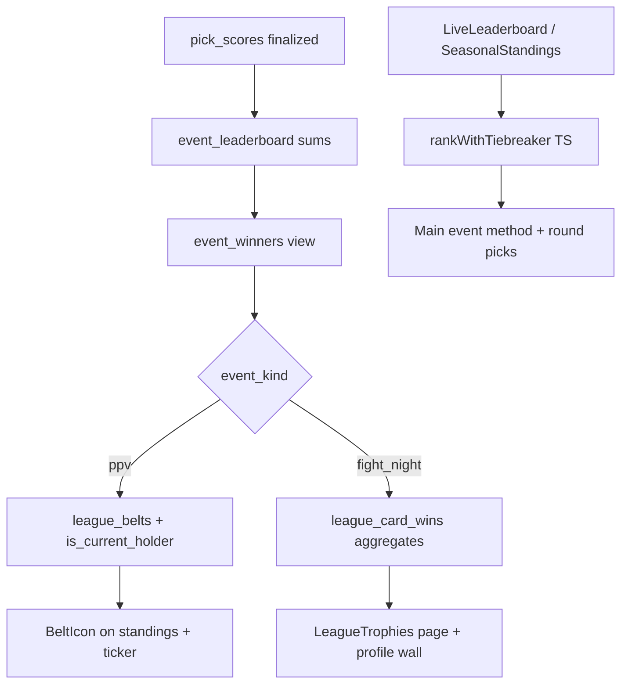

# How We Turned UFC PPV Nights Into League Championship Moments

**Project:** Ultimate Fight IQ (UFIQ)
**Link:** [https://ultimatefightiq.com](https://ultimatefightiq.com)

**Case study type:** Feature design
**The task:** Give leagues a memorable championship layer on top of per-event points: PPV belts that transfer, a trophy room, and fair tiebreakers when totals match.
**What we learned:** Derive belts and trophies from SQL views on finalized events, document main-event tiebreakers for standard leagues in UI and agent tools, and accept that SQL event-winner ranking and client tiebreaker logic serve related but not identical jobs.
**Last updated:** June 23, 2026

## Case study at a glance

| | |
|---|---|
| **The task** | Build belt transfer rules, trophy history, and tie-breaking so fight night winners feel like champions, not spreadsheet rows |
| **Who it was for** | League members competing on numbered PPV cards and Fight Nights |
| **Main constraint** | Standard leagues pick method and round on the main event; ties must break fairly without hidden rules |
| **What we built** | UFIQ Championship System: `event_winners` / `league_belts` views, trophy hooks, `rankWithTiebreaker()` on live and seasonal boards, belt UI on standings |
| **Outcome** | PPV winners can hold a transferable belt; Fight Nights add trophies without belt transfer; live and seasonal surfaces apply documented main-event tiebreakers in standard mode |

## Background

Ultimate Fight IQ leagues score points bout by bout. That works for accuracy, but fight night also needs **story**: who won the card, who holds the belt walking into the next PPV, and what happens when two members finish tied on points.

Spreadsheet pick'ems hand-wave ties. We did not want that. Standard leagues ask members to pick winner, method, and round on the main event specifically so ties can break on fight knowledge, not coin flips.

We also wanted a visible championship object: a belt that moves when a numbered UFC event finalizes, separate from Fight Night wins that count in the trophy room but never steal the belt.

## The task

Deliver:

1. Per-event winners derived from finalized cards with sensible SQL tie order.
2. A **PPV-only belt** (`league_belts`) with one current holder per league.
3. Trophy aggregates (`league_card_wins`) and surfaces: league trophy page, profile trophy wall, ticker banner.
4. **Main-event tiebreaker** in TypeScript for live and seasonal standings in standard mode.
5. Agent tools (`get_belt_holder`, `get_league_trophies`) that describe the same rules members see.

One sentence version: **make card wins feel like championships with derived belt state and explicit tie rules, not just MAX(points).**

## Constraints

- **Event classification.** PPV vs Fight Night from `event_kind_override` or name regex (`^UFC\s+\d+`).
- **Finalization gate.** Winners only when event `status IN ('verified', 'final')` and member `total_points > 0`.
- **Two ranking systems.** SQL `event_winners` breaks ties on perfect picks → boosted correct → earliest pick time; client `rankWithTiebreaker()` uses main-event method/round picks.
- **Belt is a view.** `league_belts` derives from PPV rows in `event_winners`; no mutable belt table.
- **Realtime refresh.** Belt and trophy hooks subscribe to `pick_scores` changes during live events.

## Our approach

1. **SQL layer.** Views compute event winners and belt holder from scored picks.
2. **UI layer.** Live and seasonal components rerank tied totals with main-event picks.
3. **Story layer.** Belt icon pins current holder; trophy page shows PPV history and year filters.
4. **Agent layer.** Tools read views and document standard-mode tiebreaker order in league overview skill.

## How we solved it

### Step 1: Classify PPV vs Fight Night in `event_winners`

**What we did:** SQL view assigns `event_kind` using override columns first, then regex on event name (`UFC 300` → ppv, else fight_night).

**Decision:** Explicit override wins over name heuristic.

**Why:** Marketing names vary; admins need a manual correction path.

### Step 2: Rank event winners in SQL for trophies

**What we did:** When points tie at the event level, SQL orders by `total_points DESC`, then `perfect_picks DESC`, then `boosted_correct DESC`, then `first_pick_at ASC`.

**Decision:** Earliest pick time as final SQL tiebreak for card winner rows feeding belts and trophies.

**Why:** Card winners must be deterministic in the database for history views and agent tools.

### Step 3: Derive transferable belt from latest PPV win

**What we did:** `league_belts` view filters `event_winners` to `event_kind = 'ppv'` and sets `is_current_holder` on the most recent PPV by date per league. `useCurrentBeltHolder` queries `is_current_holder = true` and refetches on `pick_scores` Realtime.

**Decision:** Belt transfers only on PPV finalize; Fight Nights never move the belt.

**Why:** Product copy and demo UI state this explicitly: Fight Nights award trophies, not belt transfer.

### Step 4: Implement main-event tiebreaker in TypeScript

**What we did:** `rankWithTiebreaker()` in `src/lib/tiebreaker.ts` loads main-event pick method/round vs result. Standard mode order: method family match → exact round (stoppages) → closest round delta → alphabetical. Until main event is final with a winner, ties share rank with `"Tied — awaiting main event result"`.

**Decision:** Apply on `LiveLeaderboard` and `SeasonalStandingsForLeague`, not in flat SQL views.

**Why:** Standard leagues already collect main-event method/round picks; the board should use them live.

**Tradeoff:** Agent tools like `get_standings` still return flat point sums; audit doc notes the gap. UI and agent copy must stay aligned on when tiebreakers apply.

### Step 5: Build trophy surfaces

**What we did:** `/leagues/:slug/trophies` (`LeagueTrophies.tsx`) shows belt holder, PPV history, card-win leaderboard, year filter. Profile `TrophyWall` shows counts and reigning champ banner. `LeagueTickerBanner` shows belt strip on league home.

**Decision:** Separate trophy page plus profile wall plus ticker, all fed by `useLeagueTrophies` / `useProfileStats`.

**Why:** Some members live in one league; others showcase cross-league history on profiles.

### Step 6: Teach the agent the rules

**What we did:** `get_belt_holder` and `get_league_trophies` tools read `league_belts` and `event_winners`. League overview skill documents standard-mode main-event tiebreaker and warns never to tell users standard leagues have "no tiebreaker."

**Decision:** Agent answers must match product rules, not generic fantasy advice.

**Why:** Misstated tie rules destroy trust faster than a wrong pick suggestion.

## What we built

| Piece | Role |
|-------|------|
| `event_winners` view | Per-event winner rows with PPV/FN kind |
| `league_belts` view | Current PPV belt holder |
| `league_card_wins` view | Aggregated wins by year and kind |
| `rankWithTiebreaker()` | Main-event method/round tiebreak (TS) |
| `useCurrentBeltHolder` | Live belt state with Realtime |
| `BeltIcon` / `ChampionPlate` | Belt visuals on standings |
| `LeagueTrophies.tsx` | Trophy room page |
| Profile `TrophyWall` | Cross-league showcase |
| Agent tools | `get_belt_holder`, `get_league_trophies` |

## Results

### Before

- Standings were flat point totals with ambiguous ties.
- No persistent championship object between PPV cards.
- Fight Night wins looked the same as numbered events in recap UI.

### After

- PPV winners feed a current belt holder surfaced on standings and ticker.
- Fight Night wins increment trophy counts without belt transfer.
- Live and seasonal boards apply documented main-event tiebreakers in standard mode.
- Trophy page and profile wall show PPV history and year filters.
- Agent tools expose belt and trophy state from the same views as the app.

### How we know it worked

- `tiebreaker.test.ts` covers method, round, and awaiting-main-event cases.
- Demo copy in `LeaderboardDemo.tsx` states belt transfer rule explicitly.
- Realtime hooks on `pick_scores` refresh belt during live events.
- Agent skill explicitly documents tiebreaker order for standard leagues.

## What you can learn

1. **Championship state can be derived.** Views over finalized results beat mutable "belt owner" rows.
2. **Separate PPV from Fight Night.** Not every card should move the same trophy object.
3. **Say tie rules out loud.** Main-event picks exist to break ties; hide that and members assume bugs.
4. **SQL and UI ties may differ.** Document both; converge agent tools over time.
5. **Realtime for story objects.** Belts during live events should update when scores do.
6. **Agent copy is product copy.** If the UI has tiebreakers, the bot must not contradict them.

## Next step

Open a standard league during a live PPV, watch `LiveLeaderboard` ranks before and after the main event finalizes, and visit `/leagues/:slug/trophies` after verification. Ask `@UFIQ` who holds the belt and compare to `BeltIcon` on seasonal standings.

For developers: change SQL winner order in migrations carefully; it affects belt history. Change TS tiebreaker in `tiebreaker.ts` and update tests plus agent skill together.
