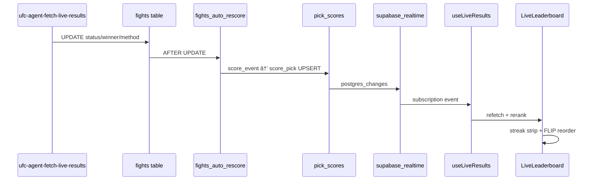

# How We Built a Live Fantasy Leaderboard That Updates as Fights Finish

**Project:** Ultimate Fight IQ (UFIQ)
**Link:** [https://ultimatefightiq.com](https://ultimatefightiq.com)

**Case study type:** Feature design
**The task:** Show league standings that move bout by bout on fight night without leaking picks before lock, recomputing scores in the browser, or stale UI when tabs background.
**What we learned:** Score in Postgres on fight updates, push changes through Realtime, and treat the live board as a broadcast UI with streak strips and tiebreakers, not a spreadsheet reread.
**Last updated:** June 23, 2026

## Case study at a glance

| | |
|---|---|
| **The task** | Build a fight-night leaderboard that updates as results land and ranks members with per-bout streak context |
| **Who it was for** | League members watching cards together on event and league pages, and in chat via `@UFIQ` |
| **Main constraint** | Other members' picks and scores must stay hidden until the event locks; the UI must stay fresh through network drops |
| **What we built** | UFIQ Live Leaderboard: DB trigger scoring → `pick_scores` Realtime → `LiveLeaderboard` with streak chips, FLIP reorder, tiebreakers, and A2UI embed |
| **Outcome** | Scores update server-side within seconds of fight row changes; the board shows rank movement, streak dots, and belt holder framing without client-side point math |

## Background

Ultimate Fight IQ is a pick'em product. Fight night is the peak moment: members want to see who is winning **now**, not after someone refreshes a static table.

Early standings views summed points from a SQL view. That worked for recap pages, but fight night needs more:

1. **Per-bout context.** Did I hit the prelim that just ended, or miss the main event still live?
2. **Privacy before lock.** RLS hides other members' `pick_scores` until `is_event_locked()`.
3. **No client scoring.** Fantasy rules include method, round, perfect-pick bonus, main-event bonus, and confidence boost. Duplicating that in React guarantees drift from Postgres.
4. **Reliability.** Mobile tabs background; Realtime alone is not enough.

The scheduler already polls live results (`ufc-agent-fetch-live-results`). The missing piece was a **broadcast-grade leaderboard** that reads authoritative scores and renders like a fight-night ticker.

## The task

Deliver a live board that:

1. Updates when `fights` rows change and `pick_scores` upserts fire.
2. Ranks members with standard-league tiebreakers once the main event has a winner.
3. Shows horizontal streak strips aligned across all member rows.
4. Gates visibility until the event is in the live window or final.
5. Embeds verbatim in league chat through A2UI (`LiveLeaderboard` component).

One sentence version: **make fight night feel live by scoring in the database and broadcasting the board, not by refreshing a table.**

## Constraints

- **Authoritative scoring in SQL.** `score_pick` and `score_event` own point math; UI only aggregates `pick_scores.points`.
- **RLS privacy.** Members see own scores always; others only after lock.
- **Two live windows.** Backend scheduler uses 6h after main card start; frontend `isEventLive()` uses 10h from lock/main card anchor for UI gating.
- **Tiebreaker scope.** `rankWithTiebreaker()` runs client-side on the live board; flat SQL views and some agent tools still return point sums only.
- **Void handling.** Cancelled, no contest, and draw fights void picks with `is_voided = true`.

## Our approach

1. **Write path.** Fight result change triggers `handle_fight_result_change()` → `score_event()` → per-pick `score_pick()` upsert.
2. **Read path.** `LiveLeaderboard` fetches members, picks, and `pick_scores`, sums points, builds streak cells from `breakdown.winner_ok` / `perfect` / void flags.
3. **Push path.** `useLiveResults` subscribes to `fights`, `events`, `pick_scores`, and `picks` with a 30s visibility-aware poll fallback.
4. **Rank path.** `rankWithTiebreaker()` breaks ties on main-event method and round picks in standard mode.
5. **Embed path.** A2UI renders the same `LiveLeaderboardForEvent` inside chat.

## How we solved it

### Step 1: Centralize scoring in `score_pick`

**What we did:** Implemented scoring in Postgres (`score_pick` migration) with league `settings.scoring` keys, confidence boost, advanced vs standard mode, and void branches for cancelled, no contest, and draw (`final` with no winner).

**Decision:** Never compute fantasy points in React.

**Why:** One source of truth prevents "why is my phone different from the web?" bugs.

### Step 2: Auto-rescore on fight updates

**What we did:** `fights_auto_rescore` trigger fires on `status`, `winner_fighter_id`, `method`, `end_round`, and `result_verified` changes, calling `score_event` when status is `final`, `no_contest`, or `cancelled`.

**Decision:** Rescore the whole event, not just one pick row in app code.

**Why:** Method and round bonuses depend on fight state; partial client updates miss edge cases.

### Step 3: Add Realtime publication with full replica identity

**What we did:** Added `pick_scores`, `picks`, `fights`, and `events` to `supabase_realtime` with `REPLICA IDENTITY FULL`.

**Decision:** Subscribe at league/event scope, not poll-only.

**Why:** Fight night updates should feel immediate when the network cooperates.

### Step 4: Build `useLiveResults` with poll fallback

**What we did:** Hook wraps Supabase channel subscriptions and refetches on postgres changes, plus default 30s poll when the tab is visible to catch dropped Realtime events.

**Decision:** Realtime plus poll, not Realtime alone.

**Why:** Mobile browsers background tabs; members still expect the board to catch up.

### Step 5: Design streak strips and aligned scroll

**What we did:** `LiveLeaderboard` orders fights main card → prelims, renders `StreakCell` dots (ok / miss / void / pending / live), and syncs horizontal scroll across rows via shared align context.

**Decision:** Broadcast UX over compact tables.

**Why:** Pick'em is bout-by-bout drama; a single points column hides the story.

### Step 6: Apply tiebreakers after main event finalizes

**What we did:** `rankWithTiebreaker()` in `src/lib/tiebreaker.ts` breaks standard-mode ties on main-event method family, exact round, closest round delta, then alphabetical. Until main event has a winner, tied members share rank with reason `"Tied — awaiting main event result"`.

**Decision:** Client-side tiebreaker on the live board even though SQL views are flat sums.

**Why:** Standard leagues explicitly pick method and round on the main event; the board should reflect that rule live.

### Step 7: Gate visibility and embed in chat

**What we did:** `LiveLeaderboardForEvent` checks `isEventLive()` from `event-live.ts` (10h window, grace for `status = 'live'`). A2UI case `"LiveLeaderboard"` resolves `event_slug` and mounts the same component in `LeagueChat`.

**Decision:** Same component in app and chat.

**Why:** Members should not get a dumbed-down markdown table when they ask `@UFIQ` for the live board.

## What we built

| Piece | Role |
|-------|------|
| `score_pick` / `score_event` | Authoritative fantasy scoring |
| `fights_auto_rescore` | Triggered rescore on fight updates |
| `pick_scores` + Realtime | Per-pick points with live push |
| `useLiveResults` | Subscriptions + 30s poll fallback |
| `LiveLeaderboard.tsx` | Broadcast UI, streak strips, FLIP reorder |
| `LiveLeaderboardForEvent.tsx` | Fetch gate + event slug resolution |
| `rankWithTiebreaker()` | Standard-mode main-event tiebreak |
| `A2UIRenderer` | Chat embed of live board |
| `event-live.ts` | Frontend live window gating |

Surfaces: Event detail league tab, league home featured card, `/leaderboard`, and `@UFIQ` chat embed.

## Results

### Before

- Standings were static sums without bout context.
- Score updates depended on manual refresh or page reload.
- Chat answers described standings in prose instead of showing the board.
- Draws and void fights had inconsistent UI treatment.

### After

- Fight row updates propagate to `pick_scores` through triggers, not client math.
- The board refetches on Realtime events with poll safety net.
- Members see streak strips, rank FLIP animation, and points-delta flash.
- Tiebreakers apply on the live board once the main event has a winner.
- `@UFIQ` embeds the production live leaderboard component.

### How we know it worked

- `LiveLeaderboard` comment and architecture docs state it does not score on the client.
- RLS tests and `is_event_locked()` gate other members' scores pre-lock.
- `useLiveResults` documents visibility-aware polling rationale.
- Draw void handling shipped in `score_pick` migration with void streak cells in UI.
- Post-event handoff swaps to `EventLeagueResults` when event is `final`.

## What you can learn

1. **Score on the write path.** If results land in the database, scoring should happen in the same transaction chain.
2. **Realtime needs a fallback.** Fight night traffic is mobile and messy; poll as backup.
3. **Broadcast UI beats tables for live sports.** Show the bout strip, not just the total.
4. **Separate scheduler live window from UI gating.** Backend lifecycle and member privacy may need different clocks.
5. **Embed the real component in chat.** Parity beats a simplified agent table.
6. **Document tiebreaker gaps.** If SQL views and chat tools return flat sums, say so and align over time.

## Next step

Open a league during a live event and watch `/leaderboard` or the event league tab. Ask `@UFIQ` for the live board in league chat and confirm the embed matches the page. For scoring rule changes, edit `score_pick` in migrations and rescore via the `score-event` edge function, never in React.

For developers: read `src/components/LiveLeaderboard.tsx` and `src/hooks/useLiveResults.ts` first; extend streak cell kinds before adding new columns.
