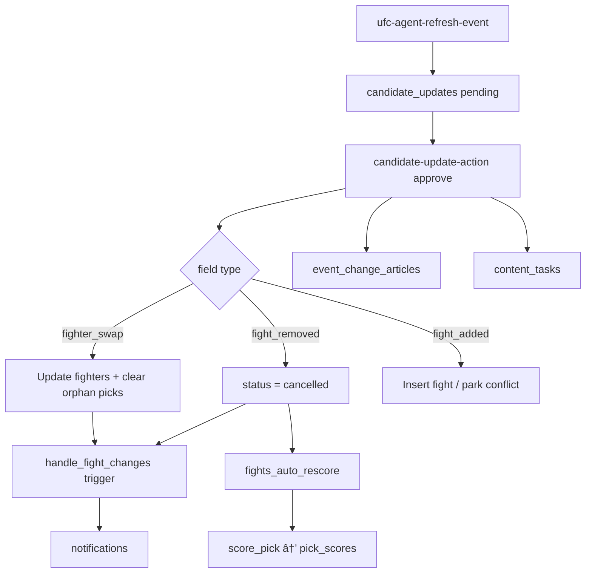

# How We Handle Cancelled Fights and Late Card Changes Without Breaking Leagues

**Project:** Ultimate Fight IQ (UFIQ)
**Link:** [https://ultimatefightiq.com](https://ultimatefightiq.com)

**Case study type:** Feature design
**The task:** Keep fantasy picks fair when UFC cards change: cancellations, no contests, draws, fighter replacements, and late additions.
**What we learned:** Separate scrape proposals from production mutations, void picks in SQL with explicit reasons, never DELETE fights users picked, and notify members with evidence-backed card update articles.
**Last updated:** June 23, 2026

## Case study at a glance

| | |
|---|---|
| **The task** | Define how pick scoring, pick rows, and member communication behave when the card changes before, during, and after lock |
| **Who it was for** | League members making picks and admins approving scraped card diffs |
| **Main constraint** | UFC cards are unstable; fairness beats speed, and pick foreign keys must survive lineup changes |
| **What we built** | UFIQ Pick Integrity System: `candidate_updates` approval path, `score_pick` void rules, orphan-pick clearing on swaps, `handle_fight_changes` notifications, and `event_change_articles` |
| **Outcome** | Cancelled, NC, and draw fights score zero for everyone with `is_voided`; replacement picks on removed fighters clear; approved changes publish cited updates on event pages |

## Background

Fantasy UFC lives on a moving target. Fighters pull out. Bouts cancel. Cards gain late matchups. Sometimes the replacement happens after members already locked picks.

If you handle that casually, trust erodes fast:

- Deleting a fight row breaks pick foreign keys.
- Scoring a cancelled bout as a miss punishes everyone who picked a winner who never fought.
- Silent card edits leave members wondering why their pick disappeared.
- Post-lock swaps without clear rules create "I would have re-picked" support threads.

Ultimate Fight IQ already had ingestion agents and a candidate review queue. The missing piece was an **integrity layer** that connects approved card mutations to scoring, notifications, and member-visible explanations.

## The task

When the card changes, the platform must:

1. Propose diffs through `candidate_updates`, not blind overwrites.
2. Cancel removed fights (`status = 'cancelled'`), never DELETE rows.
3. Void all picks on cancelled, no contest, and draw outcomes in `score_pick`.
4. Clear orphan picks when a fighter is swapped off the card; keep valid picks on fighters still listed.
5. Notify members (`fight_cancelled`, `fighter_replaced`, `opponent_change`) with deep links back to the event.
6. Insert `event_change_articles` with headline, summary, and evidence quote on admin approve.

One sentence version: **treat card chaos as a governed workflow with SQL void rules and member-visible evidence, not ad hoc fixes.**

## Constraints

- **Human gate for structural changes.** `fighter_swap`, `fight_added`, and `fight_removed` flow through `candidate-update-action`.
- **Pick lock.** `enforce_pick_lock` blocks member pick writes after `event_lock_at_utc`; service role bypasses for admin integrity fixes.
- **Post-lock swap edge case.** Orphan picks clear under service role, but members cannot re-pick if lock already passed.
- **Separate ingest paths.** Initial `syncFightsForEvent` can prune by bout order; ongoing structural integrity relies on refresh agent + approval, not silent DELETE on live cards.
- **Scoring is server-only.** `score_pick` revoked from `authenticated`; triggers and RPC own rescoring.

## Our approach

1. **Proposal layer.** Refresh agent queues diffs with AI `change_notes` and evidence gating.
2. **Apply layer.** Approve mutates fights/events, clears orphan picks on swap, cancels on removal.
3. **Notify layer.** DB trigger sends deduped notifications within 24h per user/fight/kind.
4. **Score layer.** `fights_auto_rescore` voids or scores picks; draws now void like NC (migration `20260601210851`).
5. **Surface layer.** Event page shows Card Updates strip; picker UI disables cancelled fights with overlay.

## How we solved it

### Step 1: Encode void rules in `score_pick`

**What we did:** Current `score_pick` returns `is_voided = true` with zero points for `cancelled`, `no_contest`, and `final` with no winner (draw). Pending fights score zero with `{pending: true}` until a winner exists.

**Decision:** Void cancelled/NC/draw for everyone; do not treat draw as infinite pending.

**Why:** Fairness means no member gains or loses points on outcomes that are not pickable wins.

### Step 2: Cancel removals instead of deleting fights

**What we did:** `candidate-update-action` sets `status = 'cancelled'` on `fight_removed` approve. Pick rows keep their FK; rescoring voids them.

**Decision:** Never DELETE fights referenced by picks.

**Why:** Fantasy history and audit trails need stable fight IDs.

### Step 3: Clear orphan picks on fighter swap

**What we did:** On `fighter_swap` approve, service role sets `winner_fighter_id`, `method`, and `end_round` to NULL when the picked fighter is no longer on the card. Valid picks on remaining fighters stay.

**Decision:** Asymmetric replacement, not blanket void.

**Why:** If your fighter stays on the card, your pick should still count.

### Step 4: Notify with deduped trigger

**What we did:** `handle_fight_changes` migration fires on fight UPDATE: cancellation → `fight_cancelled` warning; fighter ID change → `opponent_change` (info) or `fighter_replaced` (warning) with 24h dedup per kind.

**Decision:** Push notifications with `action_url` to `/events/{slug}`.

**Why:** Members should learn about card changes inside the product, not from Twitter.

### Step 5: Publish evidence-backed card articles

**What we did:** On approve, when `candidate_updates.notes.headline` is non-empty, insert `event_change_articles` with summary, `evidence_quote`, and sources. `EventCardUpdates.tsx` shows latest entries on the event hub.

**Decision:** Tie admin approval to member-visible explanation.

**Why:** "The card changed" without a quote feels arbitrary; evidence builds trust.

### Step 6: Reflect voids in live UI and league grids

**What we did:** `LiveLeaderboard` streak cells show `void` for cancelled, NC, and draw. `EventLeagueGrid` filters cancelled columns from matrix views but keeps them on the main event picker with red overlay. `InlineFightPicker` disables interaction on cancelled fights.

**Decision:** Different surfaces, consistent scoring semantics.

**Why:** League recap grids should not imply a cancelled bout was playable; the event card should still show what happened.

### Step 7: Queue content tasks on structural approve

**What we did:** Structural approvals auto-insert `content_tasks` via `content_task_preset_map` for social/content follow-up.

**Decision:** Card integrity and comms move together.

**Why:** Swaps are news; the ops pipeline should not start from scratch.

## What we built

| Piece | Role |
|-------|------|
| `score_pick` / `fights_auto_rescore` | Void and score picks on fight state |
| `candidate-update-action` | Approve swaps, cancels, adds |
| `handle_fight_changes` | Member notifications on mutations |
| `event_change_articles` | Evidence-backed card update strip |
| `EventCardUpdates.tsx` | Public card updates UI |
| `InlineFightPicker.tsx` | Cancelled overlay, draw/NC chips |
| `LiveLeaderboard.tsx` | Void streak cells |
| Mission Control / PendingChangesQueue | Admin approval surfaces |

## Results

### Before

- Draws could remain pending instead of voided.
- Structural card changes lacked a single approval and evidence path.
- Members had no in-product explanation when lineups shifted.
- Orphan pick behavior on swaps was inconsistent across surfaces.

### After

- Cancelled, NC, and draw all score zero with `is_voided = true`.
- Removals cancel fights; picks survive as voided rows.
- Swaps clear only picks on removed fighters.
- Notifications dedupe and deep-link to the event.
- Approved changes create `event_change_articles` with quotes and sources.

### How we know it worked

- Draw void shipped in migration `20260601210851` (documented in `draw-handling-proposal.md`).
- `candidate-update-action` is the sole insert path for `event_change_articles` on approve.
- `enforce_pick_lock` service-role bypass documented for admin integrity fixes.
- Changelog entry (2026-06-21) covers cancelled-fight UI overlay.
- Leaderboard aggregation excludes voided picks from correct-winner counts.

## What you can learn

1. **Govern card mutations.** Propose, approve, then mutate; do not scrape-to-production on live cards.
2. **Void beats miss for non-results.** Cancellations and draws are not skill failures.
3. **Preserve foreign keys.** Cancel rows; do not delete pick targets.
4. **Replacement is asymmetric.** Clear orphan picks; keep valid ones.
5. **Show your work.** Headline plus evidence quote beats silent DB edits.
6. **Plan for post-lock swaps.** Lock rules and orphan clearing must be designed together.

## Next step

Walk a test swap in `/admin/run` Before tab: approve a pending `fighter_swap`, confirm notifications, card update strip, and rescored picks. Read `docs/audits/draw-handling-proposal.md` for void semantics history.

For developers: extend void reasons in `score_pick` and mirror them in streak UI kinds; never add client-side scoring shortcuts for cancelled bouts.
