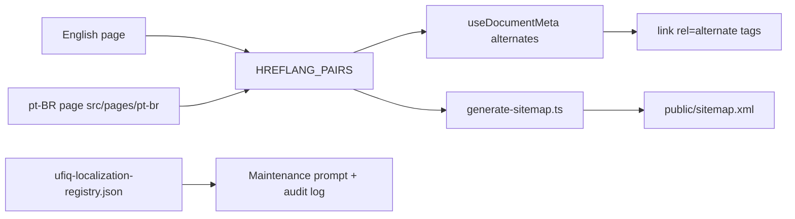

# How We Localized UFIQ for Brazil Without a Full i18n Rewrite

**Project:** Ultimate Fight IQ (UFIQ)
**Link:** [https://ultimatefightiq.com](https://ultimatefightiq.com)

**Case study type:** Product build
**The task:** Ship Brazilian Portuguese marketing and guide pages for SEO and trust in Brazil without adopting a full i18n framework or translating dynamic app surfaces.
**What we learned:** A narrow `/pt-br/...` subpath layer plus a machine-readable registry beats widget translation when only a fixed page set needs localization.
**Last updated:** June 23, 2026

## Case study at a glance

| | |
|---|---|
| **The task** | Add pt-BR counterparts for high-intent English pages with reciprocal hreflang, sitemap alternates, and glossary-approved copy |
| **Who it was for** | Brazilian visitors searching for bolão UFC, palpites, and fantasy scoring guides |
| **Main constraint** | No full i18n library; dynamic routes (events, fighters, profiles, auth, checkout) stay English-only |
| **What we built** | UFIQ pt-BR Localization Layer: ten active page pairs, `src/pages/pt-br/**`, `HREFLANG_PAIRS`, registry JSON, sitemap generator, and SEO rules |
| **Outcome** | Reciprocal `en` / `pt-BR` / `x-default` alternates on active pairs; sitemap test locks the contract; maintenance prompt keeps registry and pages in sync |

## Background

Ultimate Fight IQ is English-first. Brazil is a natural audience for UFC fantasy: bolão culture, fight-week group chats, and high search volume for pick'em guides.

A traditional i18n rollout would mean extracting every string, translating dynamic fighter pages, and maintaining parity on checkout and auth. That was too much surface for a small team still shipping core fight-night features.

We needed **high-intent static pages** in Brazilian Portuguese: home positioning, how it works, pricing context, rankings shell, comparison pages, and five SEO guides (bolão basics, scoring, running a league with friends, beginner rules, spreadsheet vs app).

Everything else (live events, pick flow, league chat, admin) could stay English until there was a business case to go deeper.

## The task

Deliver:

1. Ten English ↔ pt-BR route pairs under `/pt-br/...`.
2. Reciprocal hreflang on both sides of each pair.
3. Sitemap entries with `xhtml:link` alternates for every active pair.
4. Glossary-approved terminology (`palpites`, `bolão`, not invented synonyms).
5. A registry (`ufiq-localization-registry.json`) as source of truth for status, paths, and SEO metadata.
6. Explicit out-of-scope list so future agents do not localize checkout or dynamic pages by accident.

One sentence version: **localize the SEO funnel in pt-BR with a subpath layer, not the entire app.**

## Constraints

- **Locale tag `pt-BR` only.** Never `pt` or `pt-PT`.
- **No em dashes** in localized copy (project-wide rule).
- **No invented claims.** Pricing, features, and UFC affiliation statements mirror English sources.
- **Independence disclaimer** on relevant pages: Ultimate Fight IQ is not affiliated with UFC.
- **Pricing note.** pt-BR pricing page stays USD; checkout still routes to English `/pricing`.
- **Rankings note.** Static shell translated; live ranking rows are not.
- **Three files must stay aligned:** `hreflang.ts`, registry JSON, and `generate-sitemap.ts`.

## Our approach

1. **Registry** lists every pair with status (`proposed`, `active`, `paused`, `needs-review`).
2. **Routes** registered in `App.tsx` for `/pt-br/...` paths only.
3. **Hreflang** from single `HREFLANG_PAIRS` array; English and pt-BR pages both call `getAlternates()`.
4. **Sitemap** regenerated on `predev` / `prebuild` with reciprocal alternates.
5. **Pages** are standalone React components, not translation keys.

## How we solved it

### Step 1: Define the registry as source of truth

**What we did:** Created `docs/localization/ufiq-localization-registry.json` (mirrored in `.md`) listing English route, pt-BR route, source files, status, titles, descriptions, and last reviewed date. `docs/localization/AGENTS.md` governs changes.

**Decision:** Machine-readable registry beats scattered spreadsheets.

**Why:** Future maintenance runs need one file to diff against English sources.

### Step 2: Ship ten active page pairs

**What we did:** Added pt-BR components under `src/pages/pt-br/` for home, como funciona, preços, rankings, one compare page, and five guides. Registered routes in `App.tsx`.

**Decision:** Start with SEO and conversion pages, not app core.

**Why:** Guides drive organic search; translating `/events/:slug` does not until we commit to full locale UX.

### Step 3: Wire reciprocal hreflang

**What we did:** `src/lib/hreflang.ts` exports `HREFLANG_PAIRS`. Each page uses `useDocumentMeta({ alternates: getAlternates(path), htmlLang, ogLocale })`. English counterparts (e.g. `Pricing.tsx`) also emit alternates.

**Decision:** Both sides of a pair must link or Google ignores the cluster.

**Why:** Hreflang is reciprocal by spec; one-sided tags waste effort.

### Step 4: Generate sitemap alternates in CI path

**What we did:** `scripts/generate-sitemap.ts` duplicates pair list as `LOCALIZED_PAIRS`, emits both URLs with `xhtml:link` siblings, slightly lower priority for pt-BR. `src/lib/sitemap.test.ts` asserts every pair appears in committed `public/sitemap.xml`.

**Decision:** Test the sitemap contract, not just the generator script.

**Why:** Drift between hreflang and sitemap breaks SEO silently.

### Step 5: Enforce glossary and SEO rules

**What we did:** Documented terms in `pt-br-glossary.md` and rules in `pt-br-seo-aeo-rules.md` (metadata, FAQ schema, disclaimer). Shared layout helper `PtBrGuideLayout.tsx` for guide pages.

**Decision:** Glossary is normative, not suggestive.

**Why:** "Palpite" vs random synonyms fragment SEO and confuse readers.

### Step 6: Maintenance workflow without full i18n

**What we did:** `update-pt-br-pages-prompt.md` defines audit steps; `pt-br-update-log.md` is append-only. Status `needs-review` when English source changes.

**Decision:** Treat localization as periodic sync, not automatic string extraction.

**Why:** Standalone pages copy English intent; they do not auto-update on every PR.

## What we built

| Piece | Role |
|-------|------|
| `ufiq-localization-registry.json` | Active pairs, metadata, status |
| `src/pages/pt-br/**` | Localized page components |
| `src/lib/hreflang.ts` | Alternate URL pairs |
| `useDocumentMeta.ts` | Injects canonical, OG, alternates |
| `scripts/generate-sitemap.ts` | Sitemap with hreflang siblings |
| `sitemap.test.ts` | Contract test vs committed XML |
| `pt-br-glossary.md` | Approved terminology |
| `pt-br-seo-aeo-rules.md` | Metadata and FAQ rules |

### Active pairs (all `status: active`)

| English | pt-BR |
|---------|-------|
| `/` | `/pt-br/` |
| `/how-it-works` | `/pt-br/como-funciona` |
| `/pricing` | `/pt-br/precos` |
| `/rankings` | `/pt-br/rankings` |
| `/compare/ufc-pickem-spreadsheet` | `/pt-br/comparar/planilha-ufc-pickem` |
| `/guides/what-is-a-ufc-pickem-league` | `/pt-br/guias/o-que-e-um-bolao-ufc` |
| `/guides/how-fantasy-ufc-scoring-works` | `/pt-br/guias/como-funciona-a-pontuacao-do-fantasy-ufc` |
| `/guides/how-to-run-a-ufc-pickem-league-with-friends` | `/pt-br/guias/como-criar-um-bolao-ufc-com-amigos` |
| `/guides/ufc-pickem-rules-for-beginners` | `/pt-br/guias/regras-de-palpites-ufc-para-iniciantes` |
| `/guides/spreadsheet-vs-app-for-ufc-pickem` | `/pt-br/guias/planilha-vs-app-para-palpites-ufc` |

### Explicitly out of scope

Dynamic event/fighter/profile pages, legal, auth, checkout, admin, changelog, tasks.

## Results

### Before

- All SEO and guide traffic landed on English URLs only.
- No hreflang cluster for Brazilian Portuguese queries.
- No governed terminology for bolão/palpites copy.

### After

- Ten reciprocal en/pt-BR pairs live with sitemap alternates.
- Registry documents status, sources, and last review (2026-06-19).
- Glossary and SEO rules constrain future page edits.
- Tests fail if hreflang pairs drift from committed sitemap.
- Maintenance prompt and update log support repeatable audits.

### How we know it worked

- `sitemap.test.ts` covers every `HREFLANG_PAIRS` entry.
- Registry JSON and markdown mirror stay in sync by convention.
- `AGENTS.md` blocks flipping pages active without hreflang + sitemap + route wiring.
- pt-BR pages set `htmlLang: "pt-BR"` and `ogLocale: "pt_BR"`.

## What you can learn

1. **Localize the funnel first.** Marketing and guides beat translating every dynamic route on day one.
2. **Subpath beats query strings.** `/pt-br/...` is clear to crawlers and humans.
3. **One registry, three wiring points.** Hreflang, sitemap, and routes must match.
4. **Reciprocal alternates or bust.** Both languages link to each other.
5. **Glossary is SEO.** Consistent terms beat clever synonyms.
6. **Say what you did not translate.** Checkout and live app in English is honest scope, not failure.

## Next step

Run the maintenance prompt in `docs/localization/update-pt-br-pages-prompt.md` after any English guide edit. Regenerate sitemap with `npm run prebuild` or the sitemap script and confirm tests pass. To add an page, start in registry as `proposed`, then flip to `active` only after pt-BR file, hreflang pair, route, and sitemap entry exist.

For developers: edit `HREFLANG_PAIRS` and `LOCALIZED_PAIRS` together; never add pt-BR routes without registry entries.
