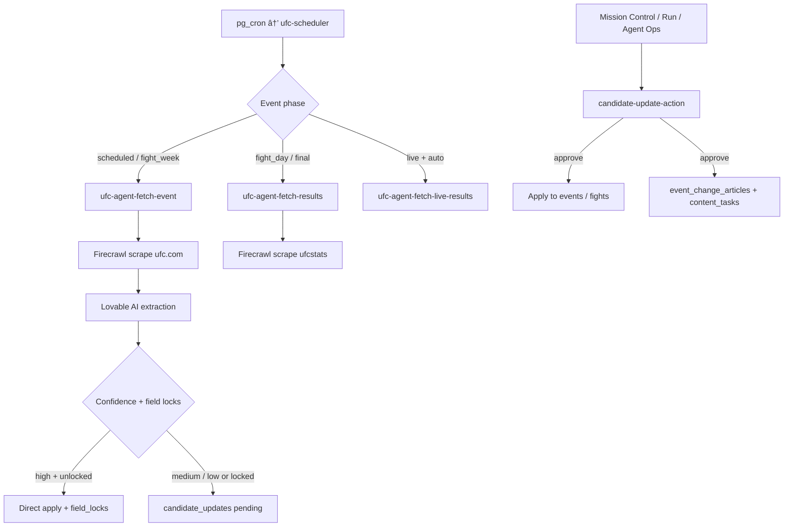

# How We Keep UFC Cards in Sync Without Shipping Bad Data

**Project:** Ultimate Fight IQ (UFIQ)
**Link:** [https://ultimatefightiq.com](https://ultimatefightiq.com)

**Case study type:** Product build
**The task:** Ingest UFC cards from the web, detect lineup changes, and apply updates without corrupting member picks, locked schedules, or published event data.
**What we learned:** Automate discovery and diffing, but route uncertain or destructive changes through a human approval queue with evidence quotes before anything touches production.
**Last updated:** June 23, 2026

## Case study at a glance

| | |
|---|---|
| **The task** | Build a pipeline that scrapes UFC.com and UFCStats, extracts structured card data, and keeps Postgres in sync through the fight week lifecycle |
| **Who it was for** | UFIQ admins and members who need accurate cards, lock times, and live results |
| **Main constraint** | UFC cards change constantly; blind overwrites break picks, schedules, and trust |
| **What we built** | UFIQ Card Ingestion Pipeline: Firecrawl scrape agents, Lovable AI extraction, `candidate_updates` review queue, Mission Control inbox, and `candidate-update-action` approval |
| **Outcome** | High-confidence scalars auto-apply with field locks; fighter swaps, fight add/remove, and low-confidence diffs wait for admin approval with cited evidence |

## Background

Ultimate Fight IQ runs on event data: fights, fighters, lock times, odds, and results. Early on, card maintenance was manual. That does not scale across a UFC season where cards swap fighters, move times, cancel bouts, and finish live on staggered clocks.

We needed automation, but automation alone is dangerous. A scraper that deletes a fight row breaks pick foreign keys. A time change after members lock picks creates support nightmares. A false-positive fighter swap from a stale page would be worse than no update at all.

The product already had pg_cron and a scheduler (`ufc-scheduler`). The missing piece was a **governed ingestion layer**: scrape and extract with AI, diff against Postgres, auto-apply only what we trust, and queue everything else for a human who can read the evidence.

## The task

Give the platform a repeatable way to:

1. Discover upcoming UFC events and ingest card structure before fight week.
2. Refresh existing cards when UFC.com changes matchups, times, or bout order.
3. Poll live results during fight night and run heavy verification after the card.
4. Never DELETE fights on removal; preserve pick integrity.
5. Show admins a review queue with headlines, summaries, and verbatim evidence quotes from the source page.

One sentence version: **turn UFC card maintenance into scrape → diff → approve, not scrape → overwrite.**

## Constraints

- **Secrets required.** Fetch and refresh agents need `FIRECRAWL_API_KEY` and `LOVABLE_API_KEY`.
- **Content locks.** When `content_locked_at` is set, initial fetch skips fight sync; refresh funnels all fight diffs to candidates.
- **Schedule locks.** When `schedule_locked_at` is set or times were manually set within 30 days, time fields never auto-apply.
- **No fight DELETE on removal.** `fight_removed` sets `status = 'cancelled'` to preserve pick references.
- **Live vs heavy agents.** While `status = 'live'`, the scheduler runs lean `ufc-agent-fetch-live-results` (~3 min) and skips heavy `ufc-agent-fetch-results` (max one per tick on fight day/final).
- **Evidence gating.** Refresh agent caps confidence when AI `evidence_quote` is missing or not found in scraped markdown.

## Our approach

We split card maintenance into four agent roles plus one approval gate:

1. **Discovery agent.** `ufc-agent-fetch-event` scrapes `ufc.com/events`, picks an event URL, extracts structure, upserts fighters, and syncs fights via `syncFightsForEvent`.
2. **Refresh agent.** `ufc-agent-refresh-event` re-scrapes an existing card, matches fights by fighter-pair key, and queues structural diffs.
3. **Results agents.** Heavy results from UFCStats with tiered auto-apply; lean live poll from UFC.com with optional auto-apply when `live_results_auto = true`.
4. **Shared diff helper.** `applyProposals()` in `_shared/diff.ts` auto-applies high-confidence fields unless locked; everything else inserts `candidate_updates`.
5. **Human gate.** `candidate-update-action` applies approved changes, writes `field_locks`, and inserts `event_change_articles`.

## How we solved it

### Step 1: Seed source lists and cap tracked events

**What we did:** Seeded `source_lists` with slug `ufc-default` pointing at UFC.com and UFCStats URLs. Fetch agent defaults to tracking up to two upcoming events (`upcoming_cap`).

**Decision:** Cap discovery instead of ingesting every URL on the index.

**Why:** Fight week ops need depth on the next cards, not a warehouse of stale pages.

### Step 2: Scrape with Firecrawl, extract with AI tool calling

**What we did:** Both fetch and refresh agents call Firecrawl `/scrape` for markdown plus links, then Lovable AI returns structured events and fights via a `report_ufc_event` schema with per-field confidence.

**Decision:** Keep extraction in the agent, not hand-written parsers for every UFC.com layout shift.

**Why:** UFC pages change markup often. AI extraction with a strict schema beats brittle CSS selectors.

### Step 3: Sync fights transactionally on initial ingest

**What we did:** `syncFightsForEvent` upserts fights by `bout_order` and prunes removed orders on first ingest. New events land with `review_state: 'draft'`.

**Decision:** Direct sync on first ingest; defer ongoing fight mutations to refresh + candidates when content is locked.

**Why:** Admins need a complete card quickly on discovery. After publish, destructive sync must not bypass review.

### Step 4: Diff refresh cards into proposals with evidence

**What we did:** Refresh agent detects event scalars, per-fight scalars, `fighter_swap`, `fight_added`, and `fight_removed`. AI attaches `change_notes` with `evidence_quote`. `evidenceMatches()` requires quotes ≥8 chars and substring-found in markdown (case-insensitive). Unverified swaps get `"Unverified:"` headlines and downgraded confidence.

**Decision:** All fight-level refresh diffs go to `candidate_updates`; no auto-apply on fight fields in refresh.

**Why:** Swaps and removals affect member picks. Admins must see the quote before approving.

### Step 5: Tier auto-apply for results with field locks

**What we did:** `applyProposals()` auto-applies high-confidence result fields (`winner_fighter_id`, `method`, verified bundles) and writes `field_locks` with source `auto_high_confidence`. Medium-confidence live progress fields can auto-apply during heavy results. Locked fields skip re-scrape churn.

**Decision:** Lock fields after apply so agents stop re-proposing the same winner.

**Why:** Live polling runs every few minutes. Without locks, the queue fills with duplicate proposals.

### Step 6: Build Mission Control as the admin inbox

**What we did:** `useMissions.ts` loads pending `candidate_updates` and builds priority cards: time disagreement → fighter swap → fight added → other. Approve calls `candidate-update-action`; stale refresh missions can re-fire `ufc-agent-refresh-event`.

**Decision:** One inbox across Mission Control, Run tab (`PendingChangesQueue`), and Agent Ops (`LiveResultsPanel`).

**Why:** Fight week is time-sensitive. Admins should not hunt three UIs for the same swap proposal.

### Step 7: Approve with downstream articles and content tasks

**What we did:** On approve, `candidate-update-action` applies the mutation, writes `field_locks` (`admin_approval`), inserts `event_change_articles` when `notes.headline` is set, and queues `content_tasks` for structural changes (swap, add, remove).

**Decision:** Tie approval to member-visible card updates and social content presets.

**Why:** When the card changes, picks, news strip, and content pipeline should move together.

## What we built

| Piece | Role |
|-------|------|
| `ufc-scheduler` | pg_cron tick, lifecycle derivation, agent dispatch |
| `ufc-agent-fetch-event` | Discovery ingest + `syncFightsForEvent` |
| `ufc-agent-refresh-event` | Non-destructive diff + evidence quotes |
| `ufc-agent-fetch-results` | Heavy UFCStats verification |
| `ufc-agent-fetch-live-results` | Lean live poll with markdown hash short-circuit |
| `candidate_updates` | Pending proposal queue with `notes` jsonb |
| `field_locks` | Per-field seal after auto-apply or admin approval |
| `candidate-update-action` | Approve/reject mutations |
| Mission Control + Run + Agent Ops | Admin review surfaces |
| `event_change_articles` | Evidence-backed card update strip on event pages |

End-to-end flow:

1. Scheduler or admin fires fetch for missing upcoming cards.
2. Firecrawl + AI writes draft events and fight structure.
3. Refresh agent queues uncertain diffs with evidence.
4. Admin approves in Mission Control.
5. Live agent polls during `status = 'live'`; heavy agent verifies after the card.
6. Approved changes publish to event pages and content tasks.

## Results

### Before

- Card updates were manual or all-or-nothing scrapes.
- Fight removals risked breaking pick foreign keys.
- No evidence trail when a fighter swapped overnight.
- Live results and post-card verification shared one blunt path.

### After

- Discovery, refresh, live poll, and heavy verify are separate agents with clear dispatch rules.
- Structural removals cancel fights instead of deleting rows.
- Admins approve swaps with verbatim quotes from UFC.com markdown.
- `field_locks` stop duplicate proposals after apply.
- Approved changes feed `event_change_articles` and social content tasks.

### How we know it worked

- Refresh agent suppresses swaps when both old fighters still appear in source markdown.
- `content_locked_at` forces refresh-only diffs through candidates.
- Live agent returns early when `last_results_md_hash` is unchanged (no LLM spend).
- Scheduler excludes heavy results while status is `live`.
- Mission Control priority ordering matches fight-week urgency.

## What you can learn

1. **Automate discovery, gate mutation.** Scraping is cheap; corrupting production data is expensive.
2. **Evidence quotes are your audit trail.** Require substring matches in source markdown before high confidence.
3. **Never DELETE domain rows users reference.** Cancel, void, lock, and preserve foreign keys.
4. **Split live poll from heavy verify.** Fight night needs speed; post-card needs accuracy.
5. **Field locks beat queue spam.** Seal approved fields so agents stop re-proposing winners.
6. **One inbox, many surfaces.** Same `candidate_updates` table powers Mission Control, Run, and Agent Ops.

## Next step

Open `/admin/mission-control` during fight week and work the pending queue. For a stale card, trigger refresh from Quick Actions and compare proposals in the Run tab Before panel. Read `docs/guides/mission-control.md` for mission types and approve flows.

For developers extending the pipeline: add diff types in `ufc-agent-refresh-event`, never bypass `candidate-update-action` for fight mutations on locked content, and keep evidence gating aligned with `evidenceMatches()`.
