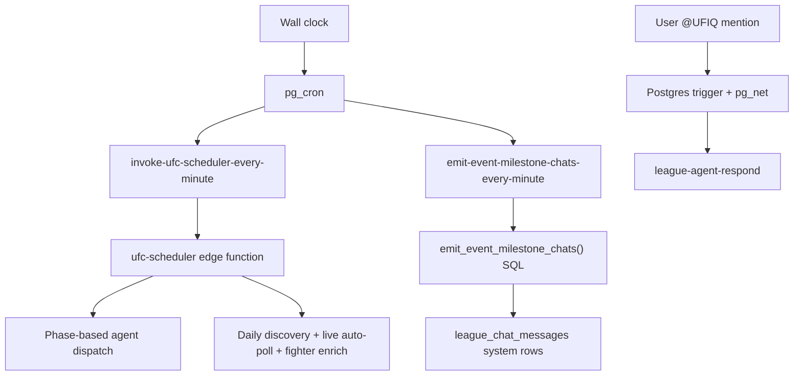

# Cron Jobs With UFIQ

**Project:** Ultimate Fight IQ (UFIQ)
**Link:** [https://ultimatefightiq.com](https://ultimatefightiq.com)

**Case study type:** Ops
**The task:** Keep UFC event data, fight results, league chat milestones, and background agents in sync without a separate job runner or always-on worker.
**What we learned:** Run one cheap tick often, put the schedule in the database, and fan out from a single orchestrator instead of registering dozens of cron entries.
**Last updated:** June 22, 2026

## Case study at a glance


|                     |                                                                                                                                                                                                                                 |
| ------------------- | ------------------------------------------------------------------------------------------------------------------------------------------------------------------------------------------------------------------------------- |
| **The task**        | Automate UFC card discovery, lifecycle transitions, results scraping, chat milestones, and bounded fighter enrichment on a predictable cadence                                                                                  |
| **Who it was for**  | Fantasy MMA league members (fresh cards, live results, lock/main-card alerts) and admins (observable agent ops)                                                                                                                 |
| **Main constraint** | Supabase stack only: Postgres, pg_cron, pg_net, and edge functions. No Redis queue, no Kubernetes CronJob, no third-party scheduler                                                                                             |
| **What we built**   | Two pg_cron jobs (orchestrator HTTP tick + SQL milestone scan), one `ufc-scheduler` edge function that self-throttles via `events.next_update_at`, shared internal auth, and an admin monitor that reads `cron.job_run_details` |
| **Outcome**         | Minute-level ticks stay cheap when nothing is due; phase-aware agents fire only when `next_update_at` elapses; league chats get idempotent milestone messages; operators can see idle vs active scheduler ticks                 |


---

## Background

Ultimate Fight IQ tracks UFC cards through a lifecycle: discovery, fight week, fight day, live, final, verified. Each phase needs different scraping cadence. A card announced weeks out can refresh daily. A live card may need lean result polls every few minutes. Picks lock at a fixed UTC time. Main card start should broadcast to every league chat.

That is a scheduling problem, but it is not a "run this function at 3:00 AM" problem. The real schedule is **per event**, driven by lock time, main card start, fight outcomes, and admin toggles. A fixed cron expression per agent would multiply quickly and fight over concurrency during overlapping cards.

UFIQ runs on Supabase. The natural clock is **pg_cron inside Postgres**, with **pg_net** for outbound HTTP to edge functions. The design goal: keep pg_cron dumb and central, keep orchestration logic in TypeScript where it is testable, and keep the authoritative "when next?" timestamp on each event row.

---

## The task

Build a background job system that:

1. Fires often enough to feel realtime during live cards without burning scrape budget on idle weeks.
2. Re-derives event lifecycle on every tick so missed runs or manual time fixes self-heal.
3. Dispatches the right agent (`ufc-agent-fetch-event`, `ufc-agent-fetch-results`, or `ufc-agent-fetch-live-results`) based on phase.
4. Posts league chat system messages at lock and card-start milestones without duplicate spam.
5. Stays observable from the admin Event Agent Ops UI.
6. Shares one internal auth pattern with other privileged edge functions.

Everything else (league AI on `@UFIQ`, admin button clicks, email dispatch) should stay **event-driven or manual**, not on the cron graph, unless there is a clear recurring need.

---

## Constraints

- **No external scheduler.** Jobs live in SQL migrations (`pg_cron`) or dynamic setup scripts (email queue). Operators cannot SSH into a worker.
- **Edge function cold starts.** A minute tick that always does heavy work would be expensive. Idle ticks must be cheap (mostly one `events` query).
- **One card at a time for heavy scrapes.** UFC runs one main card at a time; parallel full-card result scrapes are almost always stale state, not real workload.
- **Live vs final scraping must not collide.** During `live`, the heavy results agent stays off. Only the lean live-results agent runs.
- **Auth must block public abuse.** Internal endpoints use `requireAdminOrService` in `supabase/functions/_shared/auth.ts`: `x-internal-secret`, service-role bearer, or admin JWT.
- **Cron schema is not in PostgREST.** Observability requires a direct Postgres connection (`SUPABASE_DB_URL`) in `admin-agent-monitor`.

---

## Our approach

We split scheduled work into three trigger types:




| Trigger type                  | Examples                                   | Why not pg_cron?                          |
| ----------------------------- | ------------------------------------------ | ----------------------------------------- |
| **Minute pg_cron tick**       | `ufc-scheduler`, milestone chat scan       | Needs a wall clock; work varies per event |
| **Database trigger + pg_net** | `league-agent-respond` on chat insert      | Tied to user action, not time             |
| **Manual / admin UI**         | Rankings refresh, event repair, news agent | Low frequency or not yet wired to cron    |


---

## How we solved it

### Step 1: Install two pg_cron jobs, not twenty

**What we did:** Migrations enable `pg_cron` and `pg_net`, unschedule stale job names, then register exactly two recurring jobs:


| Job name                                  | Schedule    | Action                                          |
| ----------------------------------------- | ----------- | ----------------------------------------------- |
| `invoke-ufc-scheduler-every-minute`       | `* * * * `* | `net.http_post` → `/functions/v1/ufc-scheduler` |
| `emit-event-milestone-chats-every-minute` | `* * * * *` | `SELECT public.emit_event_milestone_chats()`    |


Defined in `supabase/migrations/20260502095036_8efec257-3e75-4084-9955-f5072b4e5eb1.sql` and `supabase/migrations/20260509201243_c61ab33a-a21e-4f0d-bcee-759c2b267922.sql`.

**Decision:** One orchestrator cron plus one SQL-native broadcaster. Do not cron each downstream agent separately.

**Why:** Agent cadence is per event and phase-dependent. Putting `24h / 4h / 1h / 2m` expressions in pg_cron would not track individual cards. `events.next_update_at` becomes the per-event schedule; pg_cron only asks "is anything due yet?" every minute.

The project previously used a 15-minute scheduler tick. The current migration explicitly unschedules `invoke-ufc-scheduler-every-15-minutes` and moves to every minute because the orchestrator self-throttles. Idle minutes cost one query, not a scrape.

### Step 2: Store the shared cron secret in Postgres

**What we did:** `public.internal_config` holds a `cron_secret` generated at migration time (`supabase/migrations/20260504023701_146b1ebd-8c52-4fba-a0fb-a04fbdc7c88a.sql`). Edge functions load it with a five-minute in-memory cache in `_shared/auth.ts`. Database triggers (for example `handle_league_agent_mention`) read the same value and send it as `x-internal-secret` on `net.http_post`.

**Decision:** One rotatable secret in the database, not a separate secret per function.

**Why:** pg_cron SQL and edge functions must agree on auth. Triggers already need the secret at fire time. Centralizing it in `internal_config` avoids duplicating vault entries for every HTTP caller.

Recognized callers for privileged functions:

1. Scheduled or trigger callers with matching `x-internal-secret`
2. Chained edge functions with service-role bearer
3. Logged-in admins with the `admin` role

### Step 3: Make `ufc-scheduler` the brain

**What we did:** `supabase/functions/ufc-scheduler/index.ts` runs seven logical steps each tick:

1. **Lifecycle refresh.** Load all non-`verified` events. For each, recompute status via `deriveLifecycleStatus`, auto-promote to `verified` when every fight has a final outcome, and set `next_update_at` via `deriveNextUpdateAt` (or clear it when `shouldStopPolling` says stop).
2. **Due selection.** Events whose previous `next_update_at` was in the past are "due."
3. **Concurrency guard.** At most one `ufc-agent-fetch-results` run per tick. Extra due results targets defer five minutes. Events in `live` status never enter the heavy results queue.
4. **Parallel dispatch.** Due agents call sibling functions with the service-role bearer.
5. **Discovery quota.** If fewer than two upcoming events sit in `scheduled`, `fight_week`, or `fight_day`, fire `ufc-agent-fetch-event` with `source_list_slug: "ufc-default"` so new cards appear without manual admin clicks.
6. **Live auto-poll.** For `status = live` and `live_results_auto = true`, dispatch `ufc-agent-fetch-live-results` when `last_live_results_run_at` is null or older than three minutes. Stamp the timestamp even on failure to avoid hammering.
7. **Fighter enrichment.** Up to ten fighters with `stats_fetched_at IS NULL` per tick via `ufc-fighter-image-backfill` (`mode: "unenriched"`, `limit: 10`).

**Decision:** Persist schedule state on `events.next_update_at`, not in cron metadata.

**Why:** When an admin fixes `main_card_start_utc` or a tick is missed, the next minute run recomputes everything. The scheduler also performs **predictive live promotion**: if lifecycle is `live` but no fight row is `live` yet, it marks the lowest bout-order non-final fight as `live` so the UI reacts before the next scrape corrects data.

Phase cadence from `supabase/functions/_shared/diff.ts`:


| Lifecycle status | `next_update_at` offset                               | Agent when due                                        |
| ---------------- | ----------------------------------------------------- | ----------------------------------------------------- |
| `scheduled`      | +24 hours                                             | `ufc-agent-fetch-event`                               |
| `fight_week`     | +24 hours                                             | `ufc-agent-fetch-event`                               |
| `fight_day`      | +60 minutes                                           | `ufc-agent-fetch-results`                             |
| `live`           | +1 minute (orchestrator tick; heavy results excluded) | `ufc-agent-fetch-live-results` via auto-poll (~3 min) |
| `final`          | +2 minutes                                            | `ufc-agent-fetch-results`                             |
| `verified`       | `null` (stop)                                         | none                                                  |


### Step 4: Keep idle ticks quiet

**What we did:** The scheduler inserts an `agent_runs` row with `kind = 'scheduler_tick'` only when it dispatches work, promotes a fight to live, skips concurrent results targets, runs live auto-poll, or enriches fighters. Pure lifecycle refresh with nothing due returns `{ idle: true }` and writes no row.

**Decision:** Log work, not heartbeat.

**Why:** Admin dashboards would drown in 1,440 empty ticks per day. `admin-agent-monitor` compares pg_cron fires against persisted tick rows to compute an **idle ratio** (fires that did real work vs fires that only checked).

### Step 5: Run milestone chat in SQL, not HTTP

**What we did:** `emit_event_milestone_chats()` is a `SECURITY DEFINER` PL/pgSQL function. Each minute it scans events whose lock or start timestamps passed within the last seven days, checks `event_milestones_emitted` for idempotency, inserts a system message into **every** league's chat, and records the milestone primary key `(event_id, milestone)`.

Milestones: `picks_locked`, `early_prelims_started`, `prelims_started`, `main_card_started`.

**Decision:** No edge function for broadcast milestones.

**Why:** The work is set-oriented SQL (many leagues × one message template). Running inside Postgres avoids an HTTP round trip and keeps idempotency in one transaction. `EXECUTE` is revoked from `anon` and `authenticated`; only cron and other definer paths call it.

### Step 6: Expose cron health to admins

**What we did:** `supabase/functions/admin-agent-monitor/index.ts` queries `cron.job` joined to `cron.job_run_details`, lists due events by `next_update_at`, and returns recent `ufc-scheduler` fires plus the latest `scheduler_tick` agent run. The Event Agent Ops page (`src/pages/admin/EventAgentOps.tsx`) renders pg_cron fires and agent runs side by side.

**Decision:** Direct Postgres read for cron tables; PostgREST for app data.

**Why:** Supabase does not expose the `cron` schema through the client API. A service-role edge function with `SUPABASE_DB_URL` is the smallest bridge. Admins see drift between "cron fired" and "scheduler did work," which is the first signal for auth failures, cold-start timeouts, or stuck events.

---

## What we built

### Architecture at a glance


| Layer                 | Location                                    | Role                                                               |
| --------------------- | ------------------------------------------- | ------------------------------------------------------------------ |
| Wall clock            | `pg_cron` extension                         | Fires two `* * * * `* jobs                                         |
| HTTP bridge           | `pg_net` (`net.http_post`)                  | Calls edge functions from SQL                                      |
| Orchestrator          | `supabase/functions/ufc-scheduler/index.ts` | Lifecycle, dispatch, discovery, live poll, enrich                  |
| Phase math            | `supabase/functions/_shared/diff.ts`        | `deriveLifecycleStatus`, `deriveNextUpdateAt`, `shouldStopPolling` |
| Milestone broadcaster | `public.emit_event_milestone_chats()`       | Idempotent league chat system messages                             |
| Internal auth         | `supabase/functions/_shared/auth.ts`        | `cron_secret`, service role, admin JWT                             |
| Observability         | `admin-agent-monitor` + Event Agent Ops UI  | Cron fires, due events, idle ratio                                 |
| Event-driven agent    | `handle_league_agent_mention()` trigger     | `@UFIQ` → `league-agent-respond` (not cron)                        |


### End-to-end tick flow

```
pg_cron (every minute)
  └─► ufc-scheduler
        ├─► Re-derive status + next_update_at for each active event
        ├─► Dispatch due ufc-agent-fetch-event (card refresh)
        ├─► Dispatch due ufc-agent-fetch-results (max 1/tick)
        ├─► Maybe discover next card (upcoming quota < 2)
        ├─► Maybe ufc-agent-fetch-live-results (live + auto, ~3 min gate)
        └─► Maybe ufc-fighter-image-backfill (≤10 unenriched fighters)

pg_cron (every minute, parallel)
  └─► emit_event_milestone_chats()
        └─► INSERT system messages + milestone guard rows
```

### What is intentionally not on pg_cron

Verified against migrations (only two `cron.schedule` calls in repo) and function comments:


| Function                                | How it runs today                                                                                         |
| --------------------------------------- | --------------------------------------------------------------------------------------------------------- |
| `league-agent-respond`                  | Postgres trigger on chat insert                                                                           |
| `pick-reminders`                        | Built for 15-minute cron + `x-internal-secret`; **no migration schedules it yet**                         |
| `news-agent-daily`                      | Comment says daily pg_cron; **no migration schedules it yet**                                             |
| `ufc-agent-fetch-rankings`              | Manual button on Event Agent Ops                                                                          |
| `score-event`, notifications, changelog | Admin actions or app-triggered                                                                            |
| `process-email-queue`                   | Dynamic pg_cron via email infra setup (5-second interval when queues have work), not in static migrations |


Treat these as extensions of the same auth and dispatch patterns, not gaps in the core UFC lifecycle design.

---

## Results

### Before

- Event refresh cadence was tied to a coarse 15-minute cron entry.
- Multiple agents would need separate schedules as phases multiplied.
- Milestone broadcasts risked duplicate chat noise without a durable idempotency table.
- Operators had limited visibility into "cron ran" vs "scheduler dispatched."

### After

- One minute tick with database-backed self-throttling: idle minutes stay cheap.
- Phase-aware dispatch with explicit live vs final separation and a results concurrency guard.
- Milestone chat messages are idempotent via `event_milestones_emitted`.
- Admin UI correlates pg_cron fires, scheduler tick rows, and due events.
- Fighter enrichment piggybacks on the same tick (bounded batch, predictable Firecrawl spend).

### How we know it worked

- `docs/audits/schedule-ticks.md` maps every recurring tick (note: cadence numbers there predate the current `deriveNextUpdateAt` values in `diff.ts`; trust the code for offsets).
- `ufc-scheduler` supports `dry_run: true` in the POST body for safe inspection without dispatch.
- `admin-agent-monitor` exposes `idle_ratio`, `recent_fires`, and `due_events` for incident response.
- Tracked Events panel (`src/pages/admin/run/sections/TrackedEventsPanel.tsx`) surfaces "cron runs every minute" alongside manual fetch controls.

---

## What you can learn

1. **Prefer one orchestrator over many cron entries.** When schedule depends on entity state, store `next_run_at` on the row and let a frequent cheap tick evaluate due work.
2. **Match execution environment to work shape.** HTTP edge functions for scraping and enrichment; SQL functions for set-based fan-out (milestones). Not everything needs Deno.
3. **Separate the wall clock from the business schedule.** pg_cron answers "check now." `deriveNextUpdateAt` answers "check this event again in 2 minutes vs 24 hours."
4. **Guard concurrency at the orchestrator.** UFC's operational reality (one main card) becomes a code rule: one heavy results scrape per tick, defer the rest.
5. **Make idle observable.** Compare cron fires to meaningful work rows. Silence on success is good for logs; silence without a due-event explanation is bad for ops.
6. **Keep event-driven paths event-driven.** Chat AI, admin repairs, and webhooks should not ride the minute tick unless they truly need time-based polling.

---

## Next step

Open Event Agent Ops in the admin UI and watch pg_cron fires alongside due events during a live card. For a code walkthrough, start at `supabase/migrations/20260502095036_8efec257-3e75-4084-9955-f5072b4e5eb1.sql` (cron install), then read `ufc-scheduler/index.ts` and `_shared/diff.ts`.

To add a new recurring job: decide whether it belongs in the orchestrator (state-dependent) or warrants its own pg_cron entry (fixed interval, independent domain). Reuse `internal_config.cron_secret` and `requireAdminOrService` for HTTP targets.

