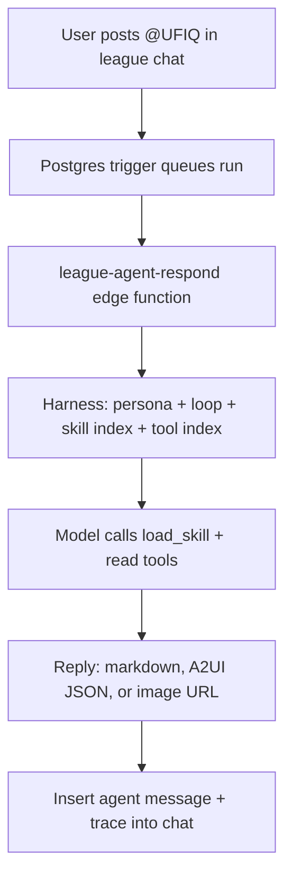

# Case Study: How UFIQ's League Agent Works (and What It Offers Users)

**Project:** Ultimate Fight IQ (UFIQ)
**Link:** [https://ultimatefightiq.com](https://ultimatefightiq.com)

**Case study type:** Product build
**The task:** Give fantasy MMA league members an in-chat AI analyst that answers league-scoped questions with grounded data, not guesses.
**What we learned:** The agent is only as trustworthy as its tool registry. Skills teach procedure; tools enforce privacy and facts.
**Last updated:** June 22, 2026

## Case study at a glance

|                     |                                                                                                                                                            |
| ------------------- | ---------------------------------------------------------------------------------------------------------------------------------------------------------- |
| **The task**        | Build an in-chat AI fight analyst that league members can `@` mention for stats, standings, picks, news, and visuals                                       |
| **Who it was for**  | Private pick'em league members competing across UFC events                                                                                                 |
| **Main constraint** | Read-only, league-scoped, and must never leak other members' picks before event lock                                                                       |
| **What we built**   | A Postgres-triggered edge function with a skills + tools harness, A2UI rich replies, and 30+ read tools backed by live database data                       |
| **Outcome**         | Members ask natural-language questions in league chat and get grounded answers in seconds, with optional inline UI, images (Pro), and a visible tool trace |

---

## Background

Ultimate Fight IQ is a social pick'em platform for UFC fans. Members join private leagues, lock in predictions before each card, earn points, climb leaderboards, and trash-talk in per-league chat. The product already had rich event, fighter, and scoring data in Supabase. What it lacked was a way to query that data conversationally without leaving the chat thread.

The goal was not a generic chatbot. It was a **league-scoped fight analyst** that could answer questions like "who is leading?", "what time does the card start for me?", or "compare Pereira and Ankalaev" using the same data the app surfaces elsewhere. Every answer had to be traceable to a tool call, and every privacy rule (especially pick visibility before lock) had to be enforced in code, not in prompt text alone.

---

## The task

When a league member types `@UFIQ` or `@iq` in chat, the agent should:

1. Understand the question in the context of that league and that member.
2. Fetch only the data it needs from the database.
3. Reply with plain text, rich inline UI, or a generated image.
4. Refuse admin actions, never invent fight results, and never reveal locked picks early.

The interaction had to feel native: threaded replies, typing indicators, realtime delivery, and optional banter when the chat is already trading shots.

---

## Constraints

- **Read-only by default.** The agent cannot rename leagues, kick members, or change settings. One write tool exists (`submit_feedback`), capped at 20 submissions per day across the whole product.
- **League scope.** Standings, picks, and member lists are always filtered to the current league.
- **Pick privacy.** Other members' individual picks stay hidden until the event lock passes. This is enforced in `get_user_picks` and `get_all_locked_picks`, not left to the model.
- **Stateless turns.** Each mention is one request. The agent loads the last 20 chat messages for context but has no long-term memory beyond that window.
- **Rate limits.** Each user gets 5 agent runs per 60 seconds. Additional mentions in that window are declined at the database trigger level.
- **Cost and latency.** The tool loop caps at 6 rounds per turn. Replies are capped at 1,900 characters (plain text) or 8,000 characters (A2UI JSON).

---

## Our approach

We split the agent into four layers:

1. **Trigger layer.** An `AFTER INSERT` trigger on `league_chat_messages` detects `@ufiq` or `@iq`, enforces rate limits, and calls the `league-agent-respond` edge function via pg_net.
2. **Harness layer.** A thin system prompt always includes persona, execution procedure, skill index (titles only), tool index (short descriptions), and grounding (league name, asker role, timezone, banter flag).
3. **Skills layer.** On-demand procedures the model loads via `load_skill`. Each skill tells the model which tools to call and in what order.
4. **Tools layer.** Typed handlers in `tools/registry.ts` that query Supabase. This is the only way the model accesses data.

Visual answers use **A2UI**, a JSON component tree rendered inline in chat (`EventHeader`, `FightRow`, `StandingsList`, `LiveLeaderboard`, `SeasonalStandings`, buttons that re-trigger the agent).

---

## How we solved it

### Step 1: Wire the trigger without blocking chat inserts

**What we did:** A Postgres function checks each new chat message for `@ufiq` or `@iq`, counts recent runs for that user, inserts a `league_agent_runs` row, and POSTs to the edge function with an internal secret header.

**Decision:** Trigger from the database, not the client.

**Why:** Chat inserts must stay fast. The agent runs asynchronously. Deleted messages and messages without a mention are skipped before any AI work starts. Rate limiting happens before the edge function is invoked, so abuse cannot burn credits.

### Step 2: Keep the always-on prompt small

**What we did:** `buildSystemPrompt` concatenates persona, a 6-step execution loop, skill titles, tool one-liners, and asker grounding. Full skill bodies and JSON tool schemas are not inlined.

**Decision:** Skills load on demand via `load_skill`.

**Why:** Skill bodies can be long (pick comparison procedures, image generation rules, winning-scenario math). Shipping them every turn would bloat tokens and latency. The model sees titles first, then pulls the procedure that matches intent.

Current skills:

| Skill                 | Typical user questions                          |
| --------------------- | ----------------------------------------------- |
| `time-and-location`   | "What time does UFC 320 start for me?"          |
| `events-and-fights`   | "What's on the next card?", fighter stats, news |
| `picks-and-standings` | Standings, my picks, member comparisons         |
| `league-overview`     | League mode, scoring, members, owner            |
| `image-generation`    | Posters, staredowns, matchup art (Pro)          |
| `winning-scenarios`   | "Who can still win?", projection math           |

### Step 3: Register every data path as an explicit tool

**What we did:** Each tool in `tools/registry.ts` owns its schema, handler, and `sideEffect` flag (`read` or `write`). Handlers return structured JSON the model must cite.

**Decision:** No implicit database access outside the registry.

**Why:** Auditable behavior. When UFIQ says a member is on a losing streak, that comes from `get_fighter_recent_fights`. When it flags a contrarian pick, that comes from `get_pick_distribution` comparing league consensus to moneyline odds on `get_event`. If a tool returns `{ error: "locked" }`, the model must stop and tell the user picks are hidden until lock.

Key tool groups:

- **League:** `get_league_overview`, `get_members`, `get_scoring_rules`, `get_belt_holder`, `get_league_trophies`
- **Events and fights:** `get_event`, `get_fight`, `get_event_times`, `get_event_news`, `get_event_storylines`, `get_event_live_state`
- **Fighters:** `get_fighter`, `compare_fighters`, `get_fighter_recent_fights`, `get_fighter_rankings`, `get_division_rankings`, `get_fighter_news`, `get_fighter_links`
- **Picks and standings:** `get_my_picks`, `get_user_picks`, `get_all_locked_picks`, `get_event_picks`, `get_pick_distribution`, `get_standings`, `get_my_event_results`
- **Rendering:** `emit_ui`, `generate_image` (Pro subscribers only)
- **Feedback:** `submit_feedback` (the only write path)

### Step 4: Enforce privacy and grounding in handlers, not prompts

**What we did:** `get_user_picks` compares `event_lock_at_utc` to `now()` and returns `{ error: "locked" }` before lock. Fuzzy member matching is restricted to the current league roster. Ambiguous handles return `{ error: "ambiguous_user", candidates: [...] }` instead of guessing.

**Decision:** Hard gates in TypeScript, soft voice rules in persona.

**Why:** Prompts drift. Code does not. The persona tells UFIQ to sound like a plain-spoken fight analyst and never invent records. The handlers guarantee it cannot leak pre-lock picks or compare members it has not resolved.

The execution loop adds a verification step: every fact in the reply must trace to a tool result on that turn. Multi-member comparisons require picks for every named member, or the agent stops with a named error.

### Step 5: Render rich answers inline with A2UI

**What we did:** When the answer is visual (standings, fight cards, comparisons), the model calls `emit_ui` with an A2UI payload. The run loop intercepts this call and writes the JSON directly as the chat message body. The frontend `A2UIRenderer` draws branded components: square corners, red reserved for primary buttons, fighter names split first/last with brand color.

**Decision:** Structured UI for lists and rankings; prose for small factual answers.

**Why:** Users scan before they read. A `StandingsList` or `LiveLeaderboard` (realtime updates during live cards) beats a wall of markdown. Buttons post `@UFIQ <action>` back into chat with hidden context, creating a click-to-drill-down loop without new UI screens.

### Step 6: Stream trace events so users see the agent working

**What we did:** Each tool call and result broadcasts over a realtime channel keyed by the user's mention message. The reply persists a `trace` array on the agent message row. Users can expand a collapsible run log under the reply.

**Decision:** Transparency over magic.

**Why:** Trust. When UFIQ calls `get_standings` then `get_event`, members see it. Typing indicators ping every 3 seconds until the reply lands. Image generation shows a skeleton placeholder until `generate_image` completes.

---

## What we built

### Architecture at a glance

| Layer         | Location                                                         | Role                                  |
| ------------- | ---------------------------------------------------------------- | ------------------------------------- |
| Trigger       | Postgres `handle_league_agent_mention()`                         | Detect mention, rate limit, queue run |
| Orchestration | `supabase/functions/league-agent-respond/index.ts`               | Auth, load context, persist reply     |
| Harness       | `harness/persona.ts`, `harness/loop.ts`, `buildSystemPrompt.ts`  | Voice, procedure, grounding           |
| Skills        | `_shared/skills/fight-iq/resources/`                             | On-demand playbooks                   |
| Tools         | `tools/registry.ts`                                              | Database queries + side effects       |
| Loop          | `runtime/runLoop.ts`                                             | Gateway calls, max 6 tool rounds      |
| Frontend      | `src/components/league/LeagueChat.tsx`, `agent/A2UIRenderer.tsx` | Render replies, trace, A2UI actions   |

### What users can ask (practical examples)

These are real capabilities backed by tools in the registry. Wording can vary; intent maps to a skill + tool chain.

**League and competition**

- "@UFIQ who is leading the league overall?"
- "@UFIQ show standings for UFC 320"
- "@UFIQ who holds the belt right now?"
- "@UFIQ who has won the most events in this league?"
- "@UFIQ how did I do at UFC 320?" (per-pick hit/miss/points via `get_my_event_results`)

**Picks and privacy**

- "@UFIQ what are my picks for the next event?"
- "@UFIQ show me Dave's picks" (blocked with a clear message until event lock, then revealed)
- "@UFIQ compare my picks vs Alex's" (requires lock; partitions shared vs swing fights)
- "@UFIQ who in the league picked the underdog?" (post-lock via `get_all_locked_picks`)
- "@UFIQ what is the market line vs how the league is picking?" (`get_pick_distribution` + odds on fights)

**Events, fights, and analysis**

- "@UFIQ what fights are on the next card?"
- "@UFIQ what time does the main card start for me?" (uses profile timezone)
- "@UFIQ is Fiziev on a losing streak?" (`get_fighter_recent_fights`)
- "@UFIQ compare Pereira and Ankalaev" (`compare_fighters`: physicals, streaks, rankings)
- "@UFIQ who is ranked in lightweight?" (`get_division_rankings`)
- "@UFIQ what are the storylines going into this card?" (`get_event_storylines`)
- "@UFIQ who's leading right now?" during a live card (`get_event_live_state` or `LiveLeaderboard` A2UI)

**Visuals and extras**

- "@UFIQ show standings" (renders `StandingsList` or `SeasonalStandings` inline)
- "@UFIQ generate a staredown poster for the main event" (Pro: `generate_image` with optional fighter reference URLs)
- "@UFIQ leave feedback that the leaderboard is hard to read on mobile" (`submit_feedback`)

**What it will not do**

- Rename the league, kick members, or change settings (politely redirects to league owner)
- Reveal other members' picks before lock (code-enforced)
- Admin operations or actions on behalf of users

Optional **banter mode** reads recent chat energy. When members are already trash-talking, UFIQ can match the tone with fight-analyst wit, but only roasts people actively in the thread. League owners can disable banter in settings.

---

## Results

### Before

- League members left chat to check event pages, fighter profiles, and standings screens separately.
- Pick comparisons before lock required trust and honor-system guessing.
- No conversational path to odds, rankings, recent form, or league pick distribution.

### After

- One `@UFIQ` mention in league chat returns grounded answers in roughly 5 to 10 seconds.
- Standings and fight cards render as native inline UI, including live leaderboards during cards.
- Pick privacy, scoring rules, and tiebreaker logic are enforced consistently via tools.
- Every run is logged in `league_agent_runs` (tokens, latency, status) for admin monitoring.

### How we know it worked

- Manual test guide covers 20 cases: mention trigger, each major tool, lock enforcement, A2UI buttons, concurrent mentions, gateway errors (`docs/guides/ufiq-agent-testing-guide.md`).
- Data access audit maps every tool to database tables and documents shipped gaps (`docs/audits/ufiq-agent-data-access-audit.md`).
- Agent monitor dashboard tracks runs, tool usage, errors, and costs for operators.
- June 2026 expansion added odds, rankings, recent fights, live state, belt/trophy history, and pick distribution without changing how users talk to UFIQ.

---

## What you can learn

1. **Put privacy in handlers, personality in prompts.** Soft rules ("never reveal picks") fail under model drift. Returning `{ error: "locked" }` from the tool does not.
2. **Skills are procedures; tools are facts.** Skills tell the model *how* to answer a class of question. Tools are the only way it gets data. Keeping skill bodies off the always-on prompt saves tokens and keeps latency predictable.
3. **Match output format to the question.** Lists and rankings deserve structured UI (A2UI). Short factual answers can stay markdown. Forcing everything into prose hurts scannability.
4. **Show your work.** A collapsible tool trace turns "AI magic" into verifiable steps. Users trust answers they can audit.
5. **Scope the agent narrowly.** UFIQ is league-scoped, read-only, and triggered by mention. That boundary makes 30+ tools manageable and prevents scope creep into admin or cross-league data leaks.

---

## Next step

Join or create a league on [Ultimate Fight IQ](https://ultimatefightiq.com), open league chat, and ask `@UFIQ` who is fighting on the next card. Expand the trace log under the reply to see which tools it called.

For developers extending the agent: add a skill module under `_shared/skills/fight-iq/resources/`, register it in the skill index, and add any new data paths as tools in `tools/registry.ts`. Mirror human-readable copies to `src/skills/fight-iq-skill/` so docs and runtime stay aligned.

---

