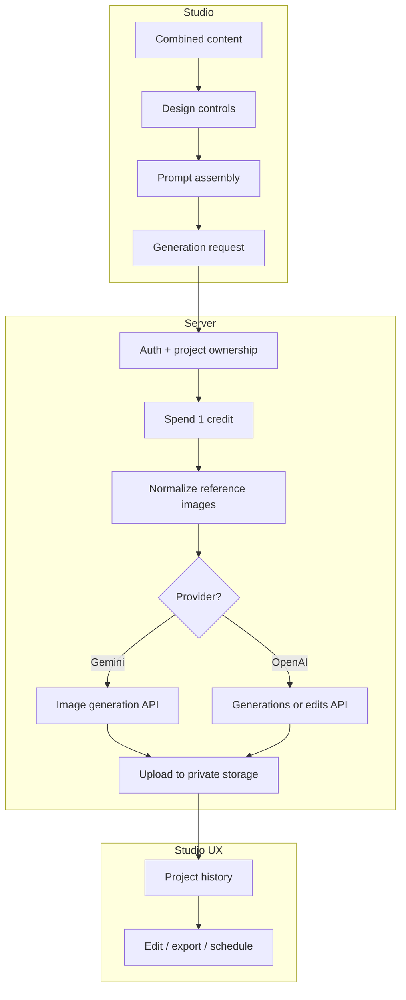
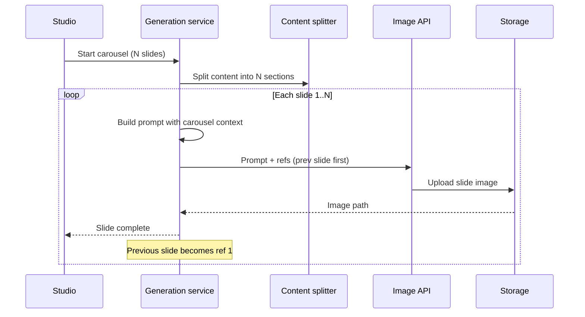

# How ViziVibes Handles Image Generation

**Project:** ViziVibes
**Link:** [https://vizivibes.com/studio](https://vizivibes.com/studio)

**Case study type:** Feature design + product build
**The task:** Turn structured content and design controls into publish-ready single images and multi-slide carousels that stay on-brand across every frame.
**What we learned:** Great AI visuals come from layered intent (content, layout, style, brand, references), not from a longer single prompt.
**Last updated:** December 31, 2026

## Case study at a glance

|                     |                                                                                                                                                                                              |
| ------------------- | -------------------------------------------------------------------------------------------------------------------------------------------------------------------------------------------- |
| **The task**        | Generate text-rich infographics and carousels that look designed, not randomly AI-generated                                                                                                  |
| **Who it was for**  | Creators, marketers, and educators who post regularly and need speed without sacrificing visual identity                                                                                     |
| **Main constraint** | Image models are probabilistic. Users still expect legible text, brand consistency, and fair billing when things fail                                                                        |
| **What we built**   | A client-side prompt assembly layer, a multi-provider generation service, carousel continuity via reference chaining, and a refinement loop (edit + style extraction)                         |
| **Outcome**         | One studio flow supports single images and carousels, three selectable models, brand kit injection, credit pre-charge with automatic refunds on failure, and slide-by-slide streaming UX     |

## Why ViziVibes image generation is different

Generic image generators optimize for **one frame that looks impressive in a thumbnail**.

ViziVibes optimizes for **assets you can post**:

- Text that remains legible at phone scale
- Layout logic that matches the content type (timeline, comparison, listicle, and more)
- Brand rules that persist across projects
- Carousel slides that read as one series, not five unrelated images

The product treats generation as the last step of a longer loop: **input, structure, design controls, generate, refine, export**. Image generation inherits everything upstream. That is the core design bet.

## Background

ViziVibes users arrive with content already written: research notes, extracted URL data, file uploads, video transcripts, or manual copy. They have also usually chosen (or inherited from a brand kit) a visual direction: style, palette, format, aspect ratio, and resolution.

The generation engine's job is not to invent the story. It is to **render the story as a designed visual** with minimal rework.

That requirement pushed us away from a thin "send user text to an API" architecture. Instead, we built a **prompt compiler** in the studio and a **provider router** on the server.

## The task

**Turn structured content plus design controls into stored, publish-ready images, including multi-slide carousels where every slide shares the same visual identity.**

Success meant:

- Single-image mode for one-shot posts
- Carousel mode for Instagram, LinkedIn, and thread-style storytelling
- Model choice without rewriting the product flow
- Edits that do not force a full regeneration from scratch

## Constraints

| Constraint               | How it shaped the system                                                                                        |
| ------------------------ | --------------------------------------------------------------------------------------------------------------- |
| **Probabilistic models** | Heavy use of guardrails, negative prompts, and reference images                                                 |
| **Text-heavy outputs**   | Explicit requirements for hierarchy, contrast, and rules against printing hex codes as visible text             |
| **Carousel consistency** | Previous slide passed as canonical reference; server-side style continuity block                                |
| **Multi-provider APIs**  | Shared internal model registry; each provider uses the right API shape for generation vs edits                  |
| **Billing trust**        | Pre-charge 1 credit per slide; refund on any hard failure                                                       |
| **Security**             | Project ownership check before storage write; validated image paths; request size caps for large references     |

## Our approach

We framed generation as three cooperating layers:

1. **Intent layer (studio):** Assemble a single text prompt from content, brand, style, format, detail level, palette, custom instructions, and carousel context.
2. **Execution layer (server):** Authenticate, charge credits, normalize references, append server-side continuity instructions, call the right provider, upload to storage.
3. **Iteration layer (studio):** Store history, support targeted edits, and extract reusable styles from reference images.

**Key decision:** Keep prompt composition in the studio for iteration speed. Keep secrets, billing, and storage on the server for security.

**Why:** Designers and product engineers can tune prompt blocks without redeploying provider credentials. The server stays focused on execution guarantees.

## The end-to-end pipeline

### Single image

1. User combines enabled content items in a project.
2. Studio resolves effective style, palette, and format (project settings, with brand kit fallbacks).
3. The prompt builder produces the full text prompt.
4. The studio calls the generation service with prompt, aspect ratio, resolution, optional references, and model choice.
5. The server charges 1 credit, calls Gemini or OpenAI, uploads the result, and returns a storage path.
6. Studio saves the path to project history and displays the result.

### Carousel

1. Content is split across N slides (AI split with a regex fallback if needed).
2. For each slide, the prompt builder runs with slide-specific content plus carousel context.
3. Reference images are packed: **previous slide first**, then user-selected refs, then brand refs (max 3 total).
4. Each slide invokes the same generation service with slide number and total count.
5. UI streams progress per slide; user can cancel between slides (the in-flight slide completes).

## How we solved it

### Step 1: Compile prompts from design primitives, not raw text alone

**What we did:** Built a prompt assembler that merges content with modular blocks: brand system prompt, custom instructions, negative prompt, series context, layout format, visual style modifiers, detail level, and palette colors.

**Decision:** Store styles, palettes, and formats as objects with model-facing instructions, not as opaque UI labels.

**Why:** The model never sees "Modern Corporate" as a label. It sees concrete direction like clean minimalist tones, sans-serif fonts, and isometric icons. Labels are for humans; modifiers are for the model.

### Step 2: Add hard guardrails for common failure modes

**What we did:** Embedded explicit rules in every generation prompt:

- Do not render custom instructions as visible text in the image
- Do not render hex color codes as text (colors are guidance only)
- Maintain hierarchy and legibility

**Decision:** Repeat "obvious" rules in the prompt rather than assuming the model will infer them.

**Why:** Text-heavy infographics fail in predictable ways. Guardrails are cheaper than support tickets.

### Step 3: Route models through one registry

**What we did:** Offered three user-facing models behind one studio flow:

| User label      | Best for                                      |
| --------------- | --------------------------------------------- |
| Nano Banana 2   | Faster iteration when exploring directions    |
| Nano Banana Pro | Default balanced quality for infographic text |
| GPT Image 2     | Reference-heavy workflows using OpenAI edits  |

**Decision:** One generation service, provider branch inside, shared validation and storage.

**Why:** Users get model choice without fragmenting billing, auth, or upload logic.

### Step 4: Treat reference images as first-class inputs

**What we did:** Accept up to three references per request. Normalize storage paths on the server. For OpenAI with refs, use the edits endpoint; for Gemini, attach images alongside the text prompt.

**Decision:** Carousel slide N > 1 always places the **previous slide** as reference image 1.

**Why:** Text instructions alone rarely lock typography and spacing across slides. Showing the model the prior frame is the strongest continuity signal we have.

### Step 5: Charge upfront, refund on failure

**What we did:** Spend credits before the API call. On provider error, missing image, upload failure, or unexpected exception, refund with a descriptive reason.

**Decision:** 1 credit per generation call (per carousel slide).

**Why:** Users tolerate probabilistic output if billing is honest. Refunds turn failures into trust instead of resentment.

### Step 6: Stream carousel progress and allow graceful stop

**What we did:** Check whether the user wants to continue before each slide after the first. The UI sets a cancel flag; completed slides remain in history.

**Decision:** Do not abort mid-request on the server. Stop between slides only.

**Why:** Hard cancellation mid-API-call complicates credit state. Between-slide stop matches user mental models ("keep what I have").

## The prompt assembly masterclass

Think of the prompt builder as a **template with conditional sections**. Only non-empty blocks are appended. Order matters for model attention: content and brand first, then requirements, then layout and style.

### Layer stack

| Layer                   | Source                             | Example                                   |
| ----------------------- | ---------------------------------- | ----------------------------------------- |
| **Data content**        | Extracted / manual project content | Stats, bullet points, narrative           |
| **Brand system prompt** | Brand kit                          | Voice, typography rules, imagery guidance |
| **Custom instructions** | Per-project user notes             | "Emphasize the 3-step framework"          |
| **Global requirements** | Fixed block in every prompt        | Legibility, no hex text, hierarchy        |
| **Negative prompt**     | Brand kit                          | "Avoid clip art, avoid neon gradients"    |
| **Series context**      | Carousel only                      | Slide position + series overview excerpt  |
| **Layout format**       | Format preset or custom            | Timeline, comparison grid, hub-and-spoke  |
| **Visual style**        | One or more style modifiers        | Combined style description strings        |
| **Detail level**        | simple / balanced / detailed       | Controls text density                     |
| **Color palette**       | Hex list or custom palette prompt  | Guided color usage without printing codes |

Styles are combinable. Custom styles and community-shared styles use the same shape, so the compiler does not need special cases.

### Server-side prompt envelope

The client prompt is not sent raw. The server wraps it with:

1. **Reference instructions** (how to interpret each attached image)
2. **Series style guardrails** (typography lock, palette lock, grid lock)
3. Client-compiled prompt body

That split keeps **creative direction** in the studio and **continuity enforcement** on the server, so carousel rules cannot be skipped.

## Multi-model routing

The generation service resolves the provider from the user's model choice, then branches:

### Gemini path

- Attaches reference images alongside the text prompt
- Requests both text and image modalities
- Maps resolution and aspect ratio into provider-specific image config

### OpenAI path

- Maps aspect ratio and resolution to valid size strings
- Maps resolution to quality tiers
- No references: standard generations endpoint
- With references: edits endpoint with multipart images

**Practical guidance for users:**

- **Nano Banana Pro:** Default for balanced quality and infographic text
- **Nano Banana 2:** Faster iteration when exploring directions
- **GPT Image 2:** When OpenAI edit behavior fits a reference-heavy workflow

## Carousel continuity

Carousel mode is three mechanisms working together:

### 1. Intelligent content splitting

AI splitting produces better narratives across slides. If that fails or returns thin sections, a regex fallback uses markdown headers, bold titles, horizontal rules, paragraphs, or fixed character chunks.

**Why both:** AI splitting produces better narratives; fallback prevents a hard stop on errors.

### 2. Series context in the prompt

Each slide prompt includes slide number, slide focus excerpt, and series overview excerpt, plus server guardrails demanding identical typography, palette, grid, and icon style.

### 3. Previous slide as canonical reference

For slide 2+, reference image 1 is the stored image from slide 1. User and brand references fill slots 2 and 3.

The server explicitly tells the model: **the first reference is the previous slide. Match it exactly.**

## Reference images: order matters

| Slot    | Single image            | Carousel slide 1        | Carousel slide 2+  |
| ------- | ----------------------- | ----------------------- | ------------------ |
| IMAGE 1 | User or brand style ref | User or brand style ref | **Previous slide** |
| IMAGE 2 | Additional ref          | Additional ref          | User or brand ref  |
| IMAGE 3 | Additional ref          | Additional ref          | Additional ref     |

User and brand references are packed up to three slots. Carousel generation prepends the previous slide and re-slices to three.

**Do not copy text verbatim from references** is repeated in server instructions unless the text is clearly part of the brand mark.

## Reliability, credits, and safety

| Mechanism              | Purpose                                                |
| ---------------------- | ------------------------------------------------------ |
| Project ownership check | Prevents writing images to another user's project      |
| Validated storage paths | Blocks path traversal in storage keys                  |
| Request size caps      | Limits payload size when references are large          |
| Input validation       | Schema validation before any charge                    |
| Credit pre-charge + refund | Aligns billing with successful delivery            |
| Creation streak rewards | Non-blocking rewards after success                  |
| Long cache on upload   | CDN-friendly delivery for generated assets             |

When no image bytes return from the provider, the user sees an error and gets the credit back. Failures are logged server-side for operations.

## The refinement loop

Generation is not the end state.

### Targeted image edits

Users describe changes against the **current** image. Optional reference images guide style. Same provider routing and credit pattern as generation. Instructions stress: apply the edit request, do not print the edit request as on-image text.

### Style extraction

Users upload a reference image. The system returns a name, description, and reusable style modifier. That modifier becomes a saved project style, closing the loop between "I like this look" and "apply it to my content."

### Project history

Every generated image is stored in project history. Users compare versions, revert, export, or schedule without losing prior passes.

## What we built

| Piece | Role |
| --- | --- |
| Prompt compiler | Merges content, brand, style, format, and carousel context into model instructions |
| Client model registry | Three user-facing models with shared studio UX |
| Generation service | Auth, billing, provider routing, storage upload |
| Content splitter | AI slide splitting with regex fallback |
| Image edit service | Instruction-based edits on existing assets |
| Style extraction | Reference image to reusable style modifier |
| Studio UI | Brand fallbacks, reference packing, streaming carousel progress |

## Results

### Before

- Users pasted content into generic image tools and got inconsistent typography, wrong layouts, or illegible text blocks.
- Multi-slide posts required manual rework in design tools to match slide 1.
- Failed API calls felt costly and opaque.

### After

- One studio action produces a stored asset ready for export or scheduling.
- Carousels split content automatically and chain visual identity slide to slide.
- Three models share one UX and billing model.
- Brand kits inject system and negative prompts without re-entry each session.

### How we know it worked

- Carousel generation completes with per-slide callbacks and partial success on cancel
- Credit refunds fire on provider, upload, and empty-response failures
- Style extraction creates reusable modifiers consumed by the same prompt path as defaults
- Default and alternate models coexist without duplicate studio flows

## What you can learn

1. **Compile prompts from structured design primitives.** Treat style, format, palette, and brand as data that renders into model instructions, not as UI-only labels.
2. **Separate creative intent from execution guarantees.** The studio compiles what the user wants; the server enforces continuity, auth, billing, and storage.
3. **Chain references for series work.** For carousels, slide N-1 as the first reference beats another paragraph of adjectives.
4. **Guardrail the predictable failures.** Text rendering, hex codes, and instruction leakage are infographic-specific failure modes. Name them explicitly in the prompt.
5. **One service, multiple providers.** Shared validation, credits, and upload logic; branch only at the HTTP call.
6. **Bill on attempt, refund on failure.** Probabilistic systems need deterministic trust signals.
7. **Always ship a fallback path.** AI content splitting plus regex fallback keeps carousels working when the splitter fails.
8. **Close the loop with extraction and edits.** Generation produces assets; extraction and edit flows turn assets into reusable brand infrastructure.

## Next step

Open the [ViziVibes studio](https://vizivibes.com/studio), attach a brand kit, pick a format and palette, and run one single image plus one five-slide carousel with the same style settings. Compare slide 2 to slide 1. That is the system working.
